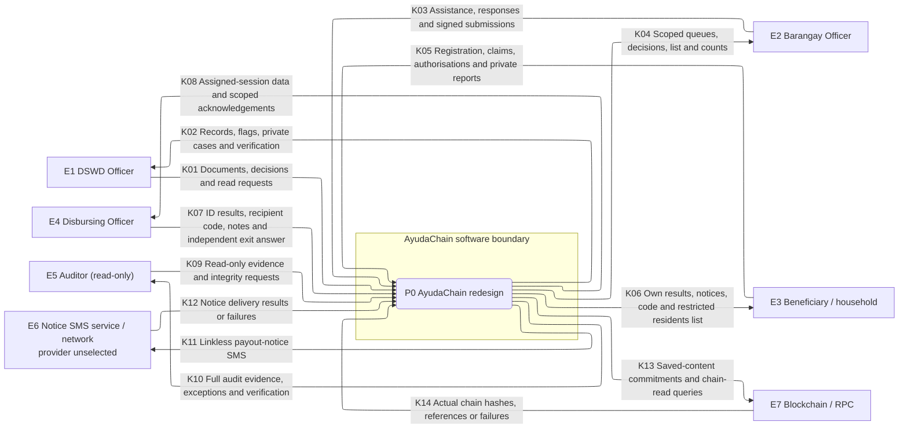
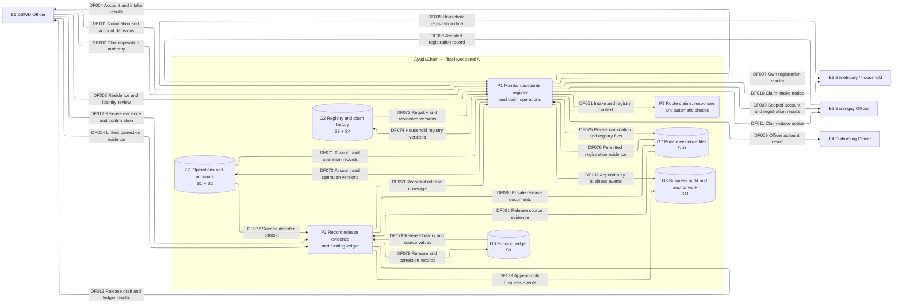
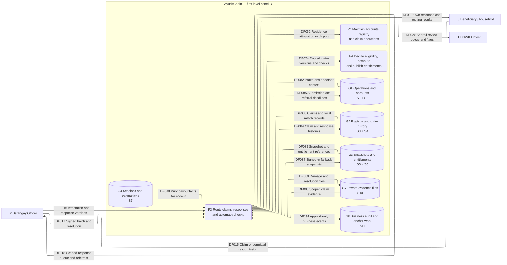
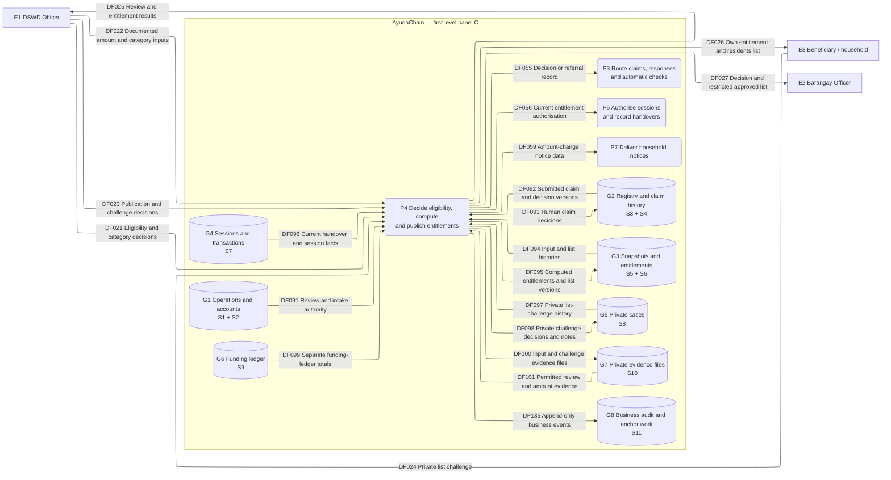
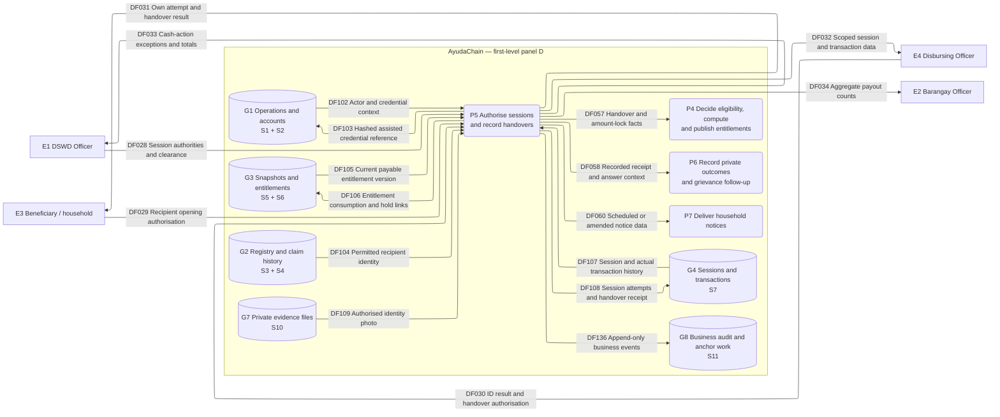
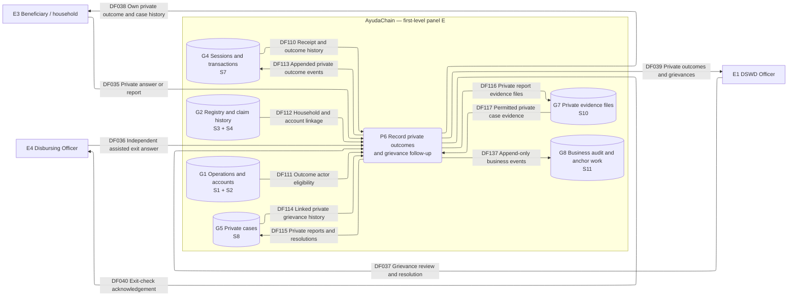
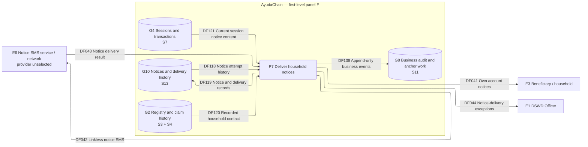
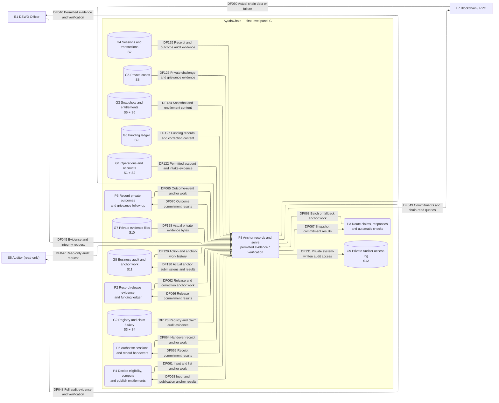

# High-level Data Flow Diagram: AyudaChain redesign

**Status: Decided ideation, not built.** This DFD documents the confirmed five-role process of 2026-10-08 to 2026-10-09. It defines logical data movement, not screens, implementation, database tables, contract functions or hash serialization. Proposed and Later capabilities remain explicitly outside the active diagrams.

## Authority and reading guide

[The end-to-end process](process.md) is the primary source for handoffs, S1–S13, exceptions and commitments. [Decisions section 16](decisions-2026-10-08.md#16-end-to-end-process-2026-10-09) records the settled session and takes precedence over earlier descriptions it clarifies. Permissions are checked against [DSWD Officer](roles/dswd-officer.md), [Barangay Officer](roles/barangay-officer.md), [Beneficiary](roles/beneficiary.md), [Disbursing Officer](roles/disbursing-officer.md) and [Auditor](roles/auditor.md).

The maintainer accepted the brief and ideation documents as authority while the PRD was absent. This document makes no new product decision. The existing-product DFD at [docs/system/dfd.md](../system/dfd.md) describes a different scope and remains separate.

The catalogue's **F1–F8**, **C1–C16** and **P1–P13** references are step IDs in `process.md`, not diagram IDs. Its named common-rule references cover prerequisites and exceptions described outside those step tables.

## System boundary and notation

AyudaChain comprises the planned application processes P1–P8 and logical off-chain stores G1–G10. It covers one DSWD Field Office, direct DSWD cash payout, one entitlement and at most one recorded handover per household per disaster. Multiple pre-handover attempts retain the same transaction ID.

The five human roles are external to the software even when they belong to DSWD. E4 denotes both the paying officer and, for a different permitted action, an independent assisted exit checker: two distinct eligible accounts of the same role. E6 is the required outbound notice-delivery capability with no selected provider. E7 is the actual chain/RPC boundary. There is no PSA, external DSWD database, automated bank, wage-feed or external document-issuer integration in these diagrams.

| Notation | Meaning |
|---|---|
| Rectangle, E1–E7 | External human role or service; never a logical application store |
| Rounded rectangle, P0 / P1–P8 | Process that receives, transforms, records or serves data; P0 is the entire system at context level |
| Cylinder, G1–G10 | Private logical store or grouped stores, not a prescribed database/schema |
| `SYS` enclosure | AyudaChain software boundary; its repeated panels are views of the same boundary |
| Directed arrow with K/DF ID and noun label | Named data movement; no control-flow branch or yes/no condition |
| K01–K14 | Context bundles, expanded exactly into boundary DF flows in the balancing table |
| DF001–DF138 | Stable active flow IDs; all are Decided, unbuilt ideation |
| OF01–OF07 | Catalogue-only exchanges outside the software, showing evidence origin or human mediation |
| PL01–PL06 | Catalogue-only Proposed/Later flows; excluded from active balancing and diagrams |

An ID repeated across panels identifies the same logical process/store, not a separate instance. Every store read/write passes through a process. Arrow order is not a workflow sequence; state transitions, deadlines and branches remain in `process.md`. Processes apply record/field permissions before returning data, including when a grouped store contains both public-to-residents projections and private contents. “Published” here means available to authorised barangay residents, not a public personal-data endpoint.

## Context diagram

Only software-boundary flows appear here. External document origins are traced separately below: the human uploader is the system's actual sender, so an issuer is not drawn as if it had an API connection.

### Context balancing

The union of these bundles is exactly the external input/output set in the first-level decomposition. Internal store/process exchanges disappear at context level. E6's delivery to the handset and recipient presentation of an ID/code to a human officer are outside-to-outside exchanges, not extra system arrows.

| Context ID | Sender | Receiver | Data bundle | First-level DF flows | Source process steps | Status |
|---|---|---|---|---|---|---|
| K01 | E1 | P0 | Documents, decisions and read requests | DF001, DF002, DF003, DF012, DF014, DF021, DF022, DF023, DF028, DF037, DF045 | F1–F4; F6–F7; C1–C3; C9; C12–C15; P1; P3; P6; P11–P12 | Decided |
| K02 | P0 | E1 | Records, flags, private cases and verification | DF004, DF013, DF020, DF025, DF033, DF039, DF044, DF046 | F2–F8; C1–C3; C6–C10; C12–C15; P2; P6; P8–P13 | Decided |
| K03 | E2 | P0 | Assistance, responses and signed submissions | DF006, DF016, DF017 | C2; C5–C6; C10 | Decided |
| K04 | P0 | E2 | Scoped queues, decisions, list and counts | DF008, DF011, DF018, DF027, DF034 | C1–C6; C9–C11; C13; P13 | Decided |
| K05 | E3 | P0 | Registration, claims, authorisations and private reports | DF005, DF015, DF024, DF029, DF035 | C2; C4; C11; C14; P4; P8; P10 | Decided |
| K06 | P0 | E3 | Own results, notices, code and restricted residents list | DF007, DF010, DF019, DF026, DF031, DF038, DF041 | C2–C7; C9–C15; P2–P12 | Decided |
| K07 | E4 | P0 | ID results, recipient code, notes and independent exit answer | DF030, DF036 | P5–P8; P10; P12 | Decided |
| K08 | P0 | E4 | Assigned-session data and scoped acknowledgements | DF009, DF032, DF040 | C1; P1; P3–P8; P10; P12–P13 | Decided |
| K09 | E5 | P0 | Read-only evidence and integrity requests | DF047 | F6; F8; C16; P13 | Decided |
| K10 | P0 | E5 | Full audit evidence, exceptions and verification | DF048 | F4–F8; C12–C16; P8–P13 | Decided |
| K11 | P0 | E6 | Linkless payout-notice SMS | DF042 | P2; P12 | Decided |
| K12 | E6 | P0 | Notice delivery results or failures | DF043 | P2 | Decided |
| K13 | P0 | E7 | Saved-content commitments and chain-read queries | DF049 | F5–F7; C6–C7; C10; C12–C15; P7–P10 | Decided |
| K14 | E7 | P0 | Actual chain hashes, references or failures | DF050 | F5–F7; C13 | Decided |

## First-level decomposition

These seven panels together form **one first-level DFD**, using P1–P8 throughout. They divide the drawing for readability; they do not add lower-level processes or new handoffs. Cross-panel arrows retain the same endpoints as the catalogue.

| Process | Responsibility and boundary |
|---|---|
| P1 | DSWD-controlled accounts, versioned registry/residence/identity/account linkage, explicit claim opening/closure; no seeded disaster creation |
| P2 | Human-confirmed source extraction, append-only funding releases/correction sets and ledger totals; no payout consumption or cash certification |
| P3 | Claims/response threads/deadlines, Punong Barangay signed batches, distinct system fallbacks and local automatic flags; no eligibility decisions |
| P4 | Human eligibility/category/challenge decisions, documented amount calculation and fixed anchored approved lists; no household-specific amount entry |
| P5 | DSWD session authorities, recipient-controlled attempts, officer ID result and once-only recorded handover; no private closing-answer access for payer |
| P6 | Recipient answers, independent assisted checks, system 72-hour outcome and private grievances/human follow-up; no payment reversal or automatic repayment |
| P7 | Version-linked household notices and delivery history; notice SMS does not establish authentication or basic-phone reply protocol |
| P8 | Exact anchor work, current integrity reads, permitted evidence/audit views and privately logged Auditor access; no Auditor business write |

### Panel A: Accounts, registration, claim opening and funds

Release coverage is evidence for DSWD's separate intake decision. P2 never opens claims or creates a cash advance. Registration assistance records the assister without granting private registry read access.

### Panel B: Claim responses, signed submissions and fallback routing

P3 produces both actual signed snapshots and clearly labelled system fallback snapshots. It forwards negative/missing responses and missing signed submissions to DSWD; local checks only flag. National ID checking stays inside P3 as a labelled simulation.

### Panel C: Human decisions, entitlement versions and publication

Eligibility can await amount inputs. P4 publishes only computed entitlements after the approved-list anchor is confirmed. Its residents-list projection omits amounts/ID/contact details; challenges remain private. Changed unpaid versions require new publication and session updates.

### Panel D: Sessions, recipient authorisation and recorded handover

The code is generated only when the recipient authorises opening; handover requires the recipient's code and a current eligible entitlement/session. Recorded handover consumes the entitlement, including disputed or unanswered receipts. P5 returns handover facts, not private closing answers, to the payer.

### Panel E: Private receipt outcomes and grievances

E4's input/output here is restricted to an independent assigned exit checker recording the recipient's answer. P6 never returns a private answer or grievance to the paying officer/barangay. The 72-hour unconfirmed event is derived inside P6 from the recorded handover timestamp, not from a drawn control-flow branch.

### Panel F: Household notices

Scheduling, changes and cancellation supply payout-notice data. E6 is a capability boundary, not a chosen API/provider. A failed delivery or no usable SMS contact reaches DSWD for outside operational notice; no authentication SMS or advance code is sent by this flow.

### Panel G: Anchoring, evidence access and read-only auditing

The chain receives only the commitment inventory below. P8 reads exact saved versions and logs actual anchor failures/retries. Auditor views and integrity reads write G9/S12 only as access history; they change no business record and expose no inspection choices to the Field Office.

## Logical store mapping and access boundaries

The grouping below preserves every logical store from [the source inventory](process.md#logical-data-stores--decided). It does not merge their record permissions or accounting meaning.

| Diagram store | Source stores | Contents / preserved boundary |
|---|---|---|
| G1 Operations and accounts | S1 Disasters and claim operations; S2 Accounts and credentials | Seeded disaster context, explicit intake/coverage/basis/duration/deadlines; nominations/positions/roles/active status, credential references and hashed assisted PINs. Intake authority, account approval and credential secrecy remain distinct. |
| G2 Registry and claim history | S3 Household registry; S4 Claims and review | Registry/fact/residence/identity/contact versions and submitted claim/response/check/decision versions. Corrected registry facts never rewrite submitted claims. Internal match access does not permit barangay identity/contact access. |
| G3 Snapshots and entitlements | S5 Batches and approved lists; S6 Amount inputs and entitlements | Three distinct immutable snapshot types: Punong Barangay signed batch, labelled unsigned fallback, DSWD approved list. Private contents commit decision/category/input/entitlement versions; residents receive a separate restricted projection. Awaiting amount is not zero. |
| G4 Sessions and transactions | S7 Sessions and transactions | Assigned session/list amendments, one transaction ID with appended attempts, code verification data, ID results, receipt, private outcome versions and notes. Payer sees cash-action/handover data; private answers are served through P6/P8 under separate permissions. |
| G5 Private cases | S8 Challenges and grievances | Private list challenges and one transaction-linked grievance with report/reopening/review/resolution history. Barangay/payer have no access; an exit checker gains no grievance access. |
| G6 Funding ledger | S9 Funds ledger | Recorded releases/source values/signatories and linked correction sets. Payouts do not write this store or become advances. Net received is recorded authority, not reconciled cash. |
| G7 Private evidence files | S10 Private file store | Immutable private off-chain documents/photos/evidence; linked record holds references/hashes/access metadata. File permissions follow that record, not a shared directory or public URL. |
| G8 Business audit and anchor work | S11 Audit events and anchor work | Append-only committed business actions plus exact required immutable commitments/actual results/retries. No plaintext credentials/codes or Field Office-visible Auditor inspection trail. |
| G9 Private Auditor access log | S12 Auditor access log | System-written views and integrity-check access, including every ID-number/photo view; hidden from the Field Office. Kept separate from G8 even though both are logs. |
| G10 Notices and delivery history | S13 Notifications | Recipient/purpose/record-version/channel/attempt/result/failure; no sign-in secret or advance payout code. |

## Flow catalogue

All active DF rows are **Decided** under `process.md`'s reading rule. They describe the planned process; they make no implementation claim. Context K flows are the aggregates already catalogued in the balancing table. Endpoint IDs resolve to the legend, process table and store mapping.

### Role and service boundary flows

| ID | Sender | Receiver | Data carried | Source process steps / rules | Status |
|---|---|---|---|---|---|
| DF001 | E1 | P1 | Documented Punong Barangay nomination, candidate/position/evidence, distinct nominator/entered-by/approver; DSWD approval/deactivation and Disbursing Officer account creation/deactivation. Seeded DSWD/Auditor accounts are not managed here. | C1; Disbursing Officer account rule | Decided |
| DF002 | E1 | P1 | Seeded disaster, selected barangays, uploaded external authority/basis, endorsement duration, explicit opening/closure decision. Release coverage alone supplies no opening authority. | C3 | Decided |
| DF003 | E1 | P1 | Documented residence confirmation/dispute resolution, identity field-check evidence, established-fact correction versions, or ID-checked lost-phone account re-link; actor/reason/history. | C2; residence and identity rules | Decided |
| DF004 | P1 | E1 | Nomination/account/registry/operation results, pending or held actions and staffing exceptions; no Auditor inspection log. | C1–C3; exceptions and loops | Decided |
| DF005 | E3 | P1 | Household identity, members, address, declared barangay, contact/account linkage and private identity evidence, whether self-registering or privately supplying fields during assistance. Declared residence begins unconfirmed. | C2 | Decided |
| DF006 | E2 | P1 | Registration assistance and household details needed for entry; named assister and assisted-registration flag. Assistance confers no access to stored identity photos, ID numbers or phone numbers. | C2 | Decided |
| DF007 | P1 | E3 | Own registry version, unconfirmed/confirmed/disputed residence, pending identity check and account-link result; no residents-list access from self-declaration. | C2; residence and identity rules | Decided |
| DF008 | P1 | E2 | Own nominated-account approval/deactivation and assistance acknowledgement; no private identity/contact fields returned. | C1–C2 | Decided |
| DF009 | P1 | E4 | Named Disbursing Officer account and active/deactivated status; authentication method/verification is not specified by this flow. | C1; Disbursing Officer account rule | Decided |
| DF010 | P1 | E3 | Disaster, explicitly opened barangay coverage and intake status/duration; later closure notice. No promise of payment or automatic opening from release coverage. | C3 | Decided |
| DF011 | P1 | E2 | Own barangay's opening/closure and response duration; existing review/referrals continue after intake closure. | C3; C10 | Decided |
| DF012 | E1 | P2 | Human-uploaded Sub-ARO, available NTA/supporting documents; selected seeded disaster; officer-confirmed amount, purpose, area/breakdown, references, dates and printed signatories. NTA is supporting evidence, not a second release. | F1–F4 | Decided |
| DF013 | P2 | E1 | Extracted prefill and machine/confirmed values, extraction failure/manual-entry route, words/figures and override warnings, missing-evidence refusal, duplicate-new-release refusal; recorded entry/correction, net received/advanced/remaining totals and separate anchor state. | F2–F5; F7–F8 | Decided |
| DF014 | E1 | P2 | Reason and atomic linked reversal/replacement; original evidence references for transcription corrections or newly uploaded amended evidence for changed source authority. | F7 | Decided |
| DF015 | E3 | P3 | Submitted registry version, disaster, stated category, damage description/evidence; once-only linked new-information resubmission after decline while intake remains open. | C4; C11 | Decided |
| DF016 | E2 | P3 | Endorsed/not-endorsed residence/affectedness attestation, category opinion, required reasons, optional damage evidence, relative declaration; withdrawal/reversal/reply or referral answer before final decision. | C5; C10 | Decided |
| DF017 | E2 | P3 | Punong Barangay's active account alone submits fixed claim/response versions, actual sender/time and uploaded council resolution. This is distinct from a system fallback. | C6 | Decided |
| DF018 | P3 | E2 | Own barangay's head/member names, address/zone, category, damage description/evidence; question and fresh deadline on referral; response/submission acknowledgement or permission refusal. No identity photos, ID numbers, phones, amounts, challenges or grievances. | C4–C6; C9–C11 | Decided |
| DF019 | P3 | E3 | Attestation, category opinion/reasons and officer name; submitted/resubmitted claim acknowledgement and actual routing exception. Negative/missing endorsement does not become a rejection. | C4–C7; C10–C11 | Decided |
| DF020 | P3 | E1 | Signed snapshot or labelled fallback with actual responses, precise “no eligible endorser”, “no barangay response” or “no barangay submission” reason; local duplicate/near-match flags, labelled simulated National ID result, risk order and per-officer figures. Batch/fallback anchor failures do not withhold the claim. | C6–C10 | Decided |
| DF021 | E1 | P4 | Human approve/final-category, decline/reason or refer/question; decision-maker and empty confirmed-by. Bulk approval only for endorsed, unflagged, undisputed claims; own-household decisions require another DSWD Officer. | C9 | Decided |
| DF022 | E1 | P4 | One disaster's documented wage-formula or category-fixed mode/input version, later documented correction, or approved-category change with reason; no typed household-specific amount. | C12; C15 | Decided |
| DF023 | E1 | P4 | Publication request for immutable approved-list version; human challenge review/reason and pre-handover approval reversal or post-handover Auditor note. No handed-over amount reversal. | C13–C15 | Decided |
| DF024 | E3 | P4 | Currently residence-confirmed resident's challenge/evidence concerning an entry on their own barangay's published list; private routing to DSWD. | C14 | Decided |
| DF025 | P4 | E1 | Eligibility/category/amount/publication results, private challenges, missing inputs or pending list anchor, independent-review staffing hold, approved entitlement total versus separate ledger balance warning, paid-difference flags and required revised publication/session work. | C9; C12–C15 | Decided |
| DF026 | P4 | E3 | Own decision/reason, computed amount/basis/input history or awaiting-amount status, old/new amount/category notices and affected-household challenge decision. Separate residents-list projection is name/zone/category only, gated by current confirmed residence and confirmed list anchor. | C9; C12–C15 | Decided |
| DF027 | P4 | E2 | Own barangay's claim decisions and anchored residents-list projection: name, zone, category only. No amounts, private challenges, receipt answers or named payout progress. | C9; C13 | Decided |
| DF028 | E1 | P5 | Schedule/open/close/cancel/amend decisions, reason/date/site, named eligible officers and published entitlement/list references; DSWD stopped-ID-check clearance for a later session and follow-up checker assignments. Physical readiness is not software certification. | P1; P3; P6; P12 | Decided |
| DF029 | E3 | P5 | Authenticated household's authorisation to open/reopen an eligible attempt; no-phone assisted recipient's privately established PIN after identity checking. Recipient controls authorisation on the officer's device; no selected phone sign-in integration is implied. | P4; assisted path | Decided |
| DF030 | E4 | P5 | Assigned officer's physical ID/person comparison result, stop/reason, recipient-supplied one-time code to record handover, later transaction note, or same-transaction state query after lost acknowledgement. No amount entry or officer-generated recipient authorisation. | P5–P7; P12; connection rule | Decided |
| DF031 | P5 | E3 | One retained transaction ID, appended attempt, short-lived code generated at opening only, current amount/session, ID-stop/expiry/hold/refusal explanation and recorded handover/receipt state. Reversed/stale entitlement, withheld/expired code or closed session never yields another payment. | P3–P7; P12 | Decided |
| DF032 | P5 | E4 | Assigned sessions/open authority; head name/photo/ID type/category/computed amount; current transaction/attempt/handover status, stop/expiry/permission result and recorded-handover progress. Read actual server state before retry. No phones, members, private closing answers/grievances. | P1; P3–P7; P12–P13 | Decided |
| DF033 | P5 | E1 | Stopped identity attempt/reason; held or invalidated authorisations, recusal/missing independent payer/checker staffing escalation, session changes, remaining unhanded entitlements and separate recorded-handover total. No silent advance or funding-ledger deduction. | P6; P12–P13; exceptions and loops | Decided |
| DF034 | P5 | E2 | Own barangay's approved/paid/remaining counts only. Paid counts recorded handovers once, not full-receipt confirmation; no recipient names, timing, amounts or outcomes. | P13 | Decided |
| DF035 | E3 | P6 | Received in full/received less/not received answer; late/revised answer or adverse report/evidence, including after session closure or pre-handover refusal/disputed physical exchange. | P8; P10; identity and code / connection rules | Decided |
| DF036 | E4 | P6 | Recipient's answer as recorded by another eligible Disbursing Officer assigned to that session, neither payer nor recipient-household member; late/revised exit check may continue after closure. No sixth role. | P8; P10; assisted path | Decided |
| DF037 | E1 | P6 | Human review/status/notes and recorded resolution of one linked private grievance; no automatic replacement payment, cash reversal or closure from a later full answer. | P11 | Decided |
| DF038 | P6 | E3 | Own appended closing answers, neutral unconfirmed state, reports and linked grievance review/resolution/reopening history; late answers remain possible. | P8–P11 | Decided |
| DF039 | P6 | E1 | Full/less/not-received answer or 72-hour neutral unconfirmed exception; new/reopened linked grievance, evidence and preserved resolutions; separate full-confirmation/disputed/unconfirmed totals for DSWD. | P8–P11; P13 | Decided |
| DF040 | P6 | E4 | Acknowledgement/permission result for the independent checker's own submitted answer only. No read access to other/private historical answers or grievance management; payer is not an authorised recipient. | P8; P10; private grievance rule | Decided |
| DF041 | P7 | E3 | Date/site/session and change/cancellation information through the household account; old/new entitlement notices. Publication alone is not a payout-session notice; no advance payout code. | C15; P2; P12 | Decided |
| DF042 | P7 | E6 | Recorded household contact and linkless scheduled date/site or changed/cancelled session notice, with record/version reference. No sign-in secret, PIN or advance payout code; provider/interface unselected. | P2; P12 | Decided |
| DF043 | E6 | P7 | Notice dispatch/delivery attempt/result or failure from the eventual delivery capability; delivery is not identity or cash-receipt proof. No selected API or guaranteed delivery policy is asserted. | P2 | Decided |
| DF044 | P7 | E1 | Delivery failures, unavailable usable SMS contact and corresponding notice/version; DSWD arranges operational notice outside the software. | P2; P12; exceptions and loops | Decided |
| DF045 | E1 | P8 | Permitted record/evidence/history selectors and current integrity re-check request; no request for the hidden Auditor access log. | F6; anchoring and integrity | Decided |
| DF046 | P8 | E1 | Private permitted evidence, shared history/anchor exceptions and current match/mismatch/required-anchor-absent/chain-unreachable result; unreadable off-chain evidence is unavailable. No S12 or disclosure of which records the Auditor inspected. | F5–F8; anchoring and integrity | Decided |
| DF047 | E5 | P8 | Browse/open evidence/exceptions/totals or request current integrity re-check; no approve/reject/correct/mark/note or payout action. | F6; F8; C16; P13 | Decided |
| DF048 | P8 | E5 | Permitted S1–S11 evidence/history, correction/duplicate/override warnings, claim and officer flags, private challenges/grievances, input and paid differences, separate funding/handover/receipt-outcome totals, real chain references/current verification results. ID numbers/photos only on opening a record; each access is logged privately. | F4–F8; C12–C16; P8–P13 | Decided |
| DF049 | P8 | E7 | Only the exact commitment inventory below: saved-content hashes and opaque references, with recorded amounts/disaster IDs for fund entries; submission or current read request. No files, names, contacts, ID details, reasons, private answers, PINs or codes. | F5–F7; C6–C7; C10; C12–C15; P7–P10; consolidated commitments | Decided |
| DF050 | E7 | P8 | Actual submission/confirmation references and read hashes, required commitment not found, RPC/read/submission failure or unavailable acknowledgement. No fabricated success; prior submission/state checked before retrying unchanged content. | F5–F7; C13; anchoring and integrity | Decided |

### Process-to-process handoffs

| ID | Sender | Receiver | Data carried | Source process steps / rules | Status |
|---|---|---|---|---|---|
| DF051 | P1 | P3 | Explicit opening/coverage/duration, active role/staffing context and submitted household linkage. No opening is inferred from a release. | C1–C4 | Decided |
| DF052 | P3 | P1 | Versioned eligible barangay residence attestation/dispute; positive attestation supports residence confirmation, dispute suspends residents-list access pending documented DSWD review; no automatic claim decline. | C5; residence and identity rules | Decided |
| DF053 | P2 | P1 | Recorded funding authority/evidence references and area coverage for DSWD's separate operation-opening decision; never an automatic intake-opening event. | F4; C3 | Decided |
| DF054 | P3 | P4 | Actual signed-batch or distinct system-fallback versions, response/referral/resubmission history and flags. Immediate no-eligible-endorser route (fewer than two active or all barred); deadline no-response or no-signed-submission route preserves any response/resolution absence. National ID result is internal and labelled simulated. | C6–C11 | Decided |
| DF055 | P4 | P3 | Final decision closes response thread; referral/question starts fresh recorded deadline and returns through checks on answer or explicit timeout fallback. Existing referrals continue after intake closes; decline permits only the one open-intake resubmission. | C9–C11 | Decided |
| DF056 | P4 | P5 | Computed entitlement version and confirmed published-list reference, or awaiting-amount/publication, hold/cancellation/change notice. Unpaid input/category changes or pre-handover reversal invalidate affected attempts/codes; revised publication and DSWD session amendments precede handover. Unchanged entitlement codes survive unrelated list additions. | C13–C15; P4; P7; P12 | Decided |
| DF057 | P5 | P4 | Actual recorded handover/locked entitlement amount/version, or unhanded/held status for challenges, recalculation and paid-difference flags; never a private receipt answer or ledger advance. | C14–C15; P7 | Decided |
| DF058 | P5 | P6 | Immutable handover reference/time, recipient/session and independent-checker assignment; pending answer context for private receipt follow-up, including an unexpectedly missing exit check. Only an unanswered recorded handover starts the 72-hour rule. | P7–P10 | Decided |
| DF059 | P4 | P7 | Affected household and old/new unpaid amount/input/category versions; paid differences remain flags, not automatic payments/recoveries. | C15 | Decided |
| DF060 | P5 | P7 | Scheduled session/date/site and affected households, or appended change/cancellation and version. Scheduling triggers notice, not approved-list publication. | P1–P2; P12 | Decided |
| DF061 | P4 | P8 | Immutable amount-input/document versions and approved-list/successor content references; only confirmed approved-list anchor releases publication. | C12–C15 | Decided |
| DF062 | P2 | P8 | Exactly saved release or linked reversal/replacement commitments and each supporting/new-amended document reference; per-commitment failures retained. | F4–F5; F7 | Decided |
| DF063 | P3 | P8 | Actual signed snapshot plus council resolution references, or labelled unsigned system-fallback snapshot; new referral-timeout fallback version when required. Individual replies/checks have no standalone anchor. | C6–C7; C10 | Decided |
| DF064 | P5 | P8 | Actual immutable handover receipt and opaque transaction/entitlement linkage; retry never resubmits cash authorisation or permits another handover. | P7 | Decided |
| DF065 | P6 | P8 | Immutable initial/late/revised answer or 72-hour neutral unconfirmed event and prior-event linkage; private answer remains off-chain, grievance notes have no standalone anchor. | P8–P10 | Decided |
| DF066 | P8 | P2 | Real per-entry/document confirmation references or explicit pending/not-anchored failure; saved release/correction still counts in the ledger, partial correction anchor failures visible. | F5; F7 | Decided |
| DF067 | P8 | P3 | Real signed/fallback snapshot and resolution anchor results/failures; routed claims remain available to DSWD regardless of anchor failure. | C6–C7; C10 | Decided |
| DF068 | P8 | P4 | Actual input/document/list anchor states/references. List failure leaves that version pending publication; unchanged-content retry, never falsely published success. | C12–C15 | Decided |
| DF069 | P8 | P5 | Actual handover receipt anchor state/reference or failure; handed-over entitlement stays consumed and amount fixed. | P7; anchoring and integrity | Decided |
| DF070 | P8 | P6 | Actual outcome-event anchor states/references or failure; saved answer/unconfirmed history remains and never creates another payment. | P8–P10; anchoring and integrity | Decided |

### Logical store reads and writes

| ID | Sender | Receiver | Data carried | Source process steps / rules | Status |
|---|---|---|---|---|---|
| DF071 | G1 | P1 | S1 seeded disasters/coverage/basis/durations and S2 nominations/roles/active status/credential references; reads for authorised administration. | C1–C3 | Decided |
| DF072 | P1 | G1 | S2 documented nomination/account decisions and household account/credential references from registration; S1 explicit opening/closure/basis/duration, preserving distinct actors and prior history. Seeded disaster/staff account creation is outside scope. | C1–C3 | Decided |
| DF073 | G2 | P1 | S3 existing household/account linkage, identity/field-check/residence evidence and earlier fact versions; no silent rewriting of submitted S4 claims. | C2; residence and identity rules | Decided |
| DF074 | P1 | G2 | S3 registry/members/address/declared barangay, private contact/identity linkage, named assister/flag and residence/field-check/re-link/correction versions. | C2; residence and identity rules | Decided |
| DF075 | P1 | G7 | Immutable nomination, operation-basis and identity/field-check evidence with linked record/version references; private off-chain storage. | C1–C3 | Decided |
| DF076 | G7 | P1 | Files for authorised DSWD residence/identity/account review and household registration; no stored identity/contact evidence returned to barangay helpers. | C1–C3; residence and identity rules | Decided |
| DF077 | G1 | P2 | Existing disaster identifier and context for release entry; no disaster creation or claims opening. | F2 | Decided |
| DF078 | G6 | P2 | S9 extraction/confirmed values, supporting references, duplicate candidates, correction sets and net totals; totals derived, never typed. | F3; F7–F8 | Decided |
| DF079 | P2 | G6 | S9 draft/source metadata then officer-confirmed recorded entry with entered-by/empty approved-by; append complete reversal/replacement as one correction operation, preserving original evidence and counting replacement once. | F2–F4; F7 | Decided |
| DF080 | P2 | G7 | S10 immutable Sub-ARO/NTA/supporting files or amended-source evidence; actual upload hashes referenced by S9 records, no chain submission merely on upload. | F2; F7 | Decided |
| DF081 | G7 | P2 | Actual private file bytes/versions for extraction/manual confirmation and linked correction evidence; missing evidence blocks saving, extraction failure still permits human entry/confirmation. | F2–F3; F7 | Decided |
| DF082 | G1 | P3 | S1 intake coverage/duration/deadlines and S2 active named officers/positions, staffing and recusal context; own/assisted household bars response, other relatives require declaration. | C4–C11 | Decided |
| DF083 | G2 | P3 | S3 submitted registry/person/ID/contact versions and S4 claims/threads/history; internal five duplicate/near-match checks only within AyudaChain. Phone sharing above three flags; identity checking is labelled simulated. Output to barangay remains restricted. | C4–C11 | Decided |
| DF084 | P3 | G2 | S4 submission/resubmission, immutable response/reply/relative declarations, explicit routing exceptions and versioned check results; no automatic eligibility decision. Earlier declines/batches remain. | C4–C11 | Decided |
| DF085 | P3 | G1 | S1 per-claim/per-referral deadline derived from the disaster's DSWD-set duration; referral does not reopen intake. | C4; C10–C11 | Decided |
| DF086 | G3 | P3 | S5 existing fixed signed/fallback snapshots plus S6 approved/handed-over entitlement linkage for duplicate detection; not an external DSWD dataset. | C6–C8; C10–C11 | Decided |
| DF087 | P3 | G3 | S5 immutable signed batch with actual Punong Barangay/resolution, or separately labelled system snapshot with exact exception/available responses and no invented signature/resolution. | C6–C7; C10 | Decided |
| DF088 | G4 | P3 | S7 household/disaster recorded-handover facts for local duplicate flags; private closing answers are not barangay queue data. | C8 | Decided |
| DF089 | P3 | G7 | S10 private immutable claim/response damage evidence or uploaded council resolution linked to its actual version; no fake fallback resolution. | C4–C6; C10–C11 | Decided |
| DF090 | G7 | P3 | Relevant damage evidence and actual resolution content for routing/review; barangay projection excludes identity photos/ID/contact details. | C4–C6; C10–C11 | Decided |
| DF091 | G1 | P4 | S1 operation/intake context and S2 active officer/recusal context for decisions and one-resubmission rules; missing independent reviewer holds/escalates. | C9; C11 | Decided |
| DF092 | G2 | P4 | S3 registry and S4 responses/referrals/checks/decisions, current eligibility/category and preserved earlier versions for human review. | C9; C12–C15 | Decided |
| DF093 | P4 | G2 | S4 approval/decline/referral and final category/reason, later category change or pre-handover approval reversal as appended decision; actor/empty confirmed-by/history retained. | C9; C14–C15 | Decided |
| DF094 | G3 | P4 | S5 actual batch/fallback/list versions and S6 documented inputs/category/entitlement versions, publication/hold/handover links and fixed paid amounts. | C9; C12–C15 | Decided |
| DF095 | P4 | G3 | One S6 household/disaster entitlement awaiting amount if inputs absent, documented mode/input versions and calculated amounts; S5 immutable pending/published/successor lists. Changed unpaid versions held, reversal cancels only unhanded entitlement; paid differences are flags. First publication locks inputs. | C9; C12–C15 | Decided |
| DF096 | G4 | P4 | S7 transaction/handover/locked amount and existing session references distinguish unpaid recalculation/pre-handover challenge from post-handover Auditor evidence. | C14–C15 | Decided |
| DF097 | G5 | P4 | S8 challenge/evidence/status and earlier review/resolution versions; shared store does not expose challenges to barangay or payer. | C14 | Decided |
| DF098 | P4 | G5 | S8 challenge/review history with affected-household decision; post-handover evidence retained for Auditor, never payment reversal. | C14 | Decided |
| DF099 | G6 | P4 | S9 net recorded funding balance for comparison with current approved entitlements including locked handed-over amounts; exceeding warns, does not block. No payout write to S9. | F8; C12–C15; financial boundary | Decided |
| DF100 | P4 | G7 | S10 immutable documented wage/category-duration or fixed-category inputs, corrected input evidence and private challenge attachments with record references. | C12; C14–C15 | Decided |
| DF101 | G7 | P4 | Actual linked input/claim/challenge files for human review and computation; wage/duration is documented input, not a live rate lookup. | C9; C12–C15 | Decided |
| DF102 | G1 | P5 | S2 active authenticated account/role and assisted credential verification references; no general phone authentication provider specified. | P3–P7; assisted path | Decided |
| DF103 | P5 | G1 | S2 privately established hashed assisted PIN after ID check; never a plaintext audit/notice/chain secret and distinct from payout code. | P4; assisted path | Decided |
| DF104 | G2 | P5 | S3 household-head name/photo reference/ID type and documented identity-field-check status/account linkage for session payment checks. Officer projection excludes ID numbers, phone and household members. | P4–P6; identity rules | Decided |
| DF105 | G3 | P5 | S5 currently confirmed published-list authorisation plus S6 eligibility/computed amount/input/category/hold/handover state; session snapshot alone cannot authorise stale/reversed entitlement. | C13–C15; P4–P7 | Decided |
| DF106 | P5 | G3 | S6 transaction/handover link and locked amount, or ID-stop/changed/expired authorisation hold/restoration under valid prerequisites; no category/eligibility decision or second handover. | P4–P7; P12 | Decided |
| DF107 | G4 | P5 | S7 date/site/assignments/list amendments, retained transaction ID/attempts/code verification data, stops/expiry and existing handover. Same actual server state resolves lost acknowledgement before retry. | P1; P3–P7; P12; connection rule | Decided |
| DF108 | P5 | G4 | S7 appended scheduling/amendments/closure, attempt and code verification data, ID result/stop/reason, expiry, step times, actual once-only handover receipt and later notes. Cash actions only in open assigned session/date; closure invalidates unused codes but permits notes/follow-up. | P1; P3–P7; P12 | Decided |
| DF109 | G7 | P5 | S10 linked household-head photo for assigned eligible officer's physical comparison; not a public file URL or permission to browse other private identity evidence. | P5 | Decided |
| DF110 | G4 | P6 | S7 handover/time, private answer versions, payer and independent checker assignments, including closed-session follow-up. Pre-handover abandoned attempts cannot become unconfirmed. | P8–P10 | Decided |
| DF111 | G1 | P6 | S2 active role/account context for own answers, human grievance review and independent assigned exit checker; paying officer receives no private outcome access. | P8–P11; assisted path | Decided |
| DF112 | G2 | P6 | S3 recipient/account/household linkage validates own access and checker's household recusal; no household identity/contact disclosure to payer/checker. | P8–P10 | Decided |
| DF113 | P6 | G4 | S7 initial/late/revised receipt answer or neutral unconfirmed after 72 hours from recorded handover, preserving every prior version; no cash action, consumption reset or repayment. | P8–P10 | Decided |
| DF114 | G5 | P6 | S8 transaction grievance/evidence/status/notes and earlier resolutions; full answer does not automatically close it. | P8; P10–P11 | Decided |
| DF115 | P6 | G5 | S8 one transaction-linked grievance opened/reopened by adverse answer/report; appended human review/status/notes/resolution. Pre-handover private reports may also reach DSWD; nothing awards payment. | P8; P10–P11; identity and code rule | Decided |
| DF116 | P6 | G7 | S10 immutable report/grievance attachments with private linked record/version references. | P8; P10–P11 | Decided |
| DF117 | G7 | P6 | Linked private report/grievance evidence for household and DSWD; no payer/barangay read access and no grievance access conferred on exit checker. | P10–P11 | Decided |
| DF118 | G10 | P7 | S13 recipient/purpose/version/channel and prior delivery/failure records for visible operational follow-up; no sign-in secret or advance code. | P2; P12; C15 | Decided |
| DF119 | P7 | G10 | S13 notice request/version, channel and delivery attempt/result/failure; preserve notices and old/new entitlement history, no advance code or sign-in secret. | C15; P2; P12 | Decided |
| DF120 | G2 | P7 | S3 household contact/account linkage for own account notices and SMS routing; never distributed to barangay/payer. | P2; C15 | Decided |
| DF121 | G4 | P7 | S7 scheduled/amended/cancelled date/site/session version; no notice just from list publication. | P2; P12 | Decided |
| DF122 | G1 | P8 | S1 operations/deadlines/authority and S2 nominations/account-action context for authorised evidence reads; credentials/secrets are not disclosed by broad audit access. | C16; common rules | Decided |
| DF123 | G2 | P8 | S3 private identity/residence/versions and S4 claims/threads/checks/decisions/flags; Auditor ID-number/photo views are record-open accesses logged only in S12. | C16 | Decided |
| DF124 | G3 | P8 | S5 exact private signed/fallback/approved-list versions and S6 inputs/entitlements/paid differences for required commitments, current integrity rehashing and audit totals. | C6–C7; C12–C16 | Decided |
| DF125 | G4 | P8 | S7 immutable receipts/outcomes/session/attempt histories; separate recorded-handover/full/disputed/unconfirmed totals, never a single assertion of receipt success. | P7–P10; P13; C16 | Decided |
| DF126 | G5 | P8 | S8 reports, decisions, notes, resolution/reopening history for authorised DSWD/Auditor reads; no standalone grievance/challenge anchor. | C14; C16; P8–P11 | Decided |
| DF127 | G6 | P8 | S9 actual recorded entries/correction sets/source/confirmed values for required anchors, rehashing and separate computed ledger totals. | F4–F8; C16 | Decided |
| DF128 | G7 | P8 | S10 exact linked immutable file versions for authorised evidence retrieval/re-hashing; missing/unreadable evidence yields unavailable, never verified. Files stay off-chain. | F5–F7; C16; consolidated commitments | Decided |
| DF129 | G8 | P8 | S11 append-only business actions, required immutable commitment references, prior actual submissions/results and retry history; no Auditor read/check selectors. | F5–F7; C16; anchoring and integrity | Decided |
| DF130 | P8 | G8 | S11 required work and actual per-commitment submission/confirmation/failure/retry history. Retry unchanged saved content after prior-state read, without re-saving release/handing over cash. Auditor integrity reads change no business record and create no Field Office-visible inspection entry. | F5–F7; anchoring and integrity | Decided |
| DF131 | P8 | G9 | S12 every Auditor view and integrity-check access, including each ID-number/photo view; system-written and hidden from the Field Office. No business decision or Auditor-authored write. | F6; C16; P13; Auditor access rules | Decided |

### Append-only business history

| ID | Sender | Receiver | Data carried | Source process steps / rules | Status |
|---|---|---|---|---|---|
| DF132 | P1 | G8 | S11 committed P1 business actions with actor/time/record/version/action/reason where required; never overwrite earlier actions or log PIN/code/sign-in secrets. Auditor reads use DF131 instead. | C1–C3; residence/identity rules | Decided |
| DF133 | P2 | G8 | S11 committed P2 business actions with actor/time/record/version/action/reason where required; never overwrite earlier actions or log PIN/code/sign-in secrets. Auditor reads use DF131 instead. | F2–F5; F7 | Decided |
| DF134 | P3 | G8 | S11 committed P3 business actions with actor/time/record/version/action/reason where required; never overwrite earlier actions or log PIN/code/sign-in secrets. Auditor reads use DF131 instead. | C4–C8; C10–C11 | Decided |
| DF135 | P4 | G8 | S11 committed P4 business actions with actor/time/record/version/action/reason where required; never overwrite earlier actions or log PIN/code/sign-in secrets. Auditor reads use DF131 instead. | C9; C12–C15 | Decided |
| DF136 | P5 | G8 | S11 committed P5 business actions with actor/time/record/version/action/reason where required; never overwrite earlier actions or log PIN/code/sign-in secrets. Auditor reads use DF131 instead. | P1; P3–P7; P12 | Decided |
| DF137 | P6 | G8 | S11 committed P6 business actions with actor/time/record/version/action/reason where required; never overwrite earlier actions or log PIN/code/sign-in secrets. Auditor reads use DF131 instead. | P8–P11 | Decided |
| DF138 | P7 | G8 | S11 committed P7 business actions with actor/time/record/version/action/reason where required; never overwrite earlier actions or log PIN/code/sign-in secrets. Auditor reads use DF131 instead. | C15; P2; P12 | Decided |

### External origin and actual application entry

These OF exchanges stay outside the AyudaChain boundary and are not active diagram edges. They account for source handoffs without inventing automated connections or additional application roles.

| ID | Sender | Receiver | Data carried and actual software entry | Source process steps / rules | Status |
|---|---|---|---|---|---|
| OF01 | Central Office / legal operation authority | DSWD Officer (E1), outside app | Release order and available NTA/supporting files, activation/coverage authority. DSWD actually uploads/confirms through DF012; operation opening/basis enters through DF002. No issuer-to-app API. | F1–F3; C3 | Decided |
| OF02 | Central Office | Government bank / Accounting and Cash, outside app | Cash authority/instructions and external financial records. None is an automated bank balance, advance or ledger write in AyudaChain; available supporting documents enter only when DSWD uploads DF012. | F1; F8 financial boundary; P1 | Decided |
| OF03 | Punong Barangay, as nominator outside app | DSWD Officer (E1) | Documented candidate/position/nomination evidence, including initial accounts. DSWD enters and approves through DF001, with distinct nominator/entered-by/approver. | C1 | Decided |
| OF04 | Barangay council, outside app | Punong Barangay's approved Barangay Officer account (E2) | Council resolution. The Punong Barangay uploads it with the actual signed snapshot via DF017; no council API and no resolution invented for fallback. | C6 | Decided |
| OF05 | Authorised operation / wage-setting authority / applicable LGU agreements | DSWD Officer (E1) | Documented applicable wage, category duration (including LGU-agreed duration where applicable) or fixed-category basis, and operation authority. Human-uploaded DF022/DF002, not an automated wage/LGU integration. | C3; C12; C15 | Decided |
| OF06 | Notice SMS service/mobile network (E6) | Recorded household handset (E3) | Delivery of the linkless date/site/change/cancellation notice requested by DF042; service result enters DF043. It carries no sign-in/payout secret and creates no authenticated reply route. | P2; P12 | Decided |
| OF07 | Recipient (E3) | Assigned Disbursing Officer (E4), at site | Accepted photo ID for human comparison and recipient-released transaction code after counting cash; independent checker receives the recipient's dictated answer. Officer records only the permitted result/code via DF030 or independent answer via DF036. PIN authorisation stays private on the assisted device via DF029. Physical cash is outside the DFD. | P4–P8; assisted path | Decided |

### Proposed and Later flows excluded from active diagrams

These are planning/deferred catalogue entries, not operative paths or selected integrations. They are excluded from K balancing, store-write coverage and the active anchor inventory.

| ID | Sender | Receiver | Data carried / unresolved boundary | Source process steps / rules | Status |
|---|---|---|---|---|---|
| PL01 | Beneficiary (E3) | Account/authentication boundary associated with P1 | Proposed phone signup/sign-in credentials and result. Method/provider, SMS authentication integration and free-tier feasibility are unresolved; no external auth service/API or working OTP flow is asserted. | Common authentication rule; P4 other access paths; decision 16.16 | Proposed |
| PL02 | Beneficiary (E3), via future text channel | P5/P6, interface unresolved | Basic-phone transaction authorisation and authenticated receipt reply. Protocol/provider/reply authentication are Later; notice SMS is insufficient. | P4 other access paths; decision 16.27 | Later |
| PL03 | Recipient with a registered phone / officer assistance | P5 | Assisted-path request with recorded reason for a registered-phone recipient; the Decided no-phone assisted path does not authorise this expansion. | Payout assisted / other access paths; Beneficiary confirmation-path proposals | Proposed |
| PL04 | P5/P7, if selected later | Recorded household handset | Proposed post-handover text confirmation, irrespective of path; content/channel policy unresolved. This does not expand the Decided scheduling/change/cancellation notice into an implemented receipt/authentication protocol. | Beneficiary: how the payout is confirmed | Proposed |
| PL05 | DSWD / Accounting and Cash, future boundary | Funding/accounting process, interface unresolved | Certification, cash advance, return and liquidation evidence/acceptance decisions. No active advance/return event or inferred liquidation on session closure. | F8 financial boundary; P1; P12–P13; decision 16.27 | Later |
| PL06 | Auditor (E5) / future reporting process | Field Office / export recipient, interface unresolved | Audit observation and response, review marks/notes or formal reporting exports; absent from this read-only Auditor process. | C16; Auditor Later capabilities; anchoring inventory exclusions | Later |

## Exact anchoring inventory and failure routes

The inventory is copied in meaning from [the consolidated commitments](process.md#consolidated-commitments), not extended to all records sharing G8.

| Anchor-work flow into P8 | Required commitment | Private source / chain boundary |
|---|---|---|
| DF062 | Fund-release entry and each supporting document | S9 entry and S10 actual files; hashes, opaque entry/disaster references and recorded amount |
| DF062 | Reversing and replacement entries; amended evidence when applicable | Immutable linked correction contents/amounts; original evidence references for transcription correction, new evidence hashes for changed release source. Each commitment's result remains visible. |
| DF061 | Amount-input version and its documents, including later changes | S6 confirmed version plus S10 documents; hashes and opaque version/disaster references |
| DF063 | Signed barangay batch and council resolution | Actual S5 signed snapshot/S10 resolution; hashes and opaque references, no names/signatures in plaintext |
| DF063 | Labelled system fallback snapshot, including referral-timeout fallback | Actual S5 exception snapshot hash and opaque reference; never falsely labelled barangay endorsement |
| DF061 | Approved-list version and each revised version | S5 private claim/decision/category/entitlement/input version snapshot hash and opaque version/barangay/disaster references |
| DF064 | Recorded handover receipt | S7 actual receipt containing amount/input/list/actor/session/time privately; chain receives receipt hash and opaque transaction/entitlement linkage, never code/PIN/identity |
| DF065 | Outcome event: initial answer, 72-hour unconfirmed, late or amended answer | S7 immutable outcome hash and opaque transaction/prior-event linkage; the private answer stays off-chain |

Registrations, nominations/accounts, opening/closure, individual responses/replies/checks/decisions, challenges/grievance notes, session changes, pre-handover stops/expiry, notifications and access logs have **no standalone required anchor**. Relevant response/decision versions are committed through batch/list snapshots. Their absence from the chain is not a required-anchor failure.

P8 records actual submission/read results through DF049–DF050 and G8; failures return DF066–DF070. Retry reuses exactly saved content and checks prior submission/state first. Release entries still count after failure; handovers remain consumed; an approved list remains pending until its own anchor is confirmed. Partial correction/document failures remain visible. No retry fabricates a transaction hash, overwrites evidence, repeats cash handover or republishes different content as the same version.

Evidence reads through P8 rehash actual stored content and compare with an actually read chain hash. Results distinguish match, mismatch, required anchor absent and chain unreachable; unreadable/missing off-chain evidence is explicitly unavailable. A prior successful check never substitutes for a failed current read. A match proves content continuity, not authentic source documents, true affectedness or physical full cash receipt.

## Permission, accounting and exception checks

- **Human decisions remain human.** P3's five local duplicate checks/near matches, risk ordering, relative/assisted-registration/staffing flags and labelled National ID simulation never decide eligibility. P4 requires an independent DSWD reviewer for own-household claims; P5/P6 require eligible independent payer/checker. Missing independent staff holds/escalates for later staffing, rather than creating another role or bypass.
- **Intake is explicit and non-vetoable.** DF002/DF010–DF011 open selected barangays separately from recorded release coverage. P3 assigns fresh submission/referral deadlines. “No eligible endorser” (including fewer than two active officers or all barred), “no barangay response” and “no barangay submission” are distinct fallback reasons. Not-endorsed claims and actual unsent responses reach DSWD without a fabricated signature/resolution. Late review/referrals survive intake closure; once-only new-information resubmission requires open intake.
- **Residence and identity serve different purposes.** Declared residence routes a claim but does not grant list access. Current confirmation gates DF026; new disputes suspend access pending DSWD review. No-ID households can register/claim flagged; handover waits for documented DSWD field check and accepted photo ID. Established-fact corrections require new recorded versions and review; only DSWD re-links a lost-phone account after an ID check.
- **Views are projections, not store access.** Barangay receives scoped claims and relevant damage evidence, but no identity photos/IDs/phones/amounts, private challenges or grievances. The household receives the officer's attestation, category opinion/reasons and name. Residents see their barangay's name/zone/category list only; their own entitlement amount/basis is a separate response. Disbursing Officers receive the restricted assigned-session identity/amount fields. Payer never receives private answers/grievances; an independent checker records only the recipient's answer without becoming a sixth role.
- **Publication and payment use current versions.** Approval may create an awaiting-amount entitlement. Computation plus confirmed approved-list anchor precede publication. Unpaid input/category changes hold/recalculate, expire stale attempts/codes, notify old/new amounts, require revised list publication and DSWD session amendments. Pre-handover reversal cancels the entitlement. Unchanged entitlement versions survive unrelated list additions, but added/changed payable session membership requires amendment. Handed-over amount versions remain fixed; differences are review flags.
- **Cash authorisation is separate from outcome.** One transaction ID retains appended attempts; unused attempts expire and may reopen only under current eligibility/session rules, with DSWD clearance/later session after ID stops. Recipient counts cash before releasing the code; no code means no handover. Closed/cancelled sessions expire unused codes and end cash actions, while answers, independent assigned checks and notes continue. An unanswered handover becomes neutral unconfirmed after 72 hours, with late/revised answers retained. No outcome authorises another handover.
- **Adverse reports remain private and durable.** DF035/DF036 create or reopen one transaction-linked grievance; previous answers/resolutions remain. A later full answer does not close it automatically. DSWD records human review/resolution; post-handover list challenges are Auditor evidence. No software cash reversal, shortfall payment or overpayment recovery is implied.
- **Totals preserve the financial boundary.** G6 received is net recorded releases after linked correction sets; remaining is received minus advanced plus returns. Without advance/return events, advanced/returns have no feeding entries and remaining equals net releases. G4 handover and receipt-outcome totals are separate; DF099 only reads G6 for an approved-total warning, never deducts payouts. Schedule/closure is not cash certification or liquidation.
- **Failures preserve facts.** Missing evidence blocks release save; failed extraction goes to human entry/confirmation; words/figures disagreement warns; duplicate independent release is refused/logged, while a linked correction may reuse its source evidence. Anchor errors use immutable retries. Lost connection/acknowledgement requires reading the same transaction before retry, never offline payout/queued handover. Notice failure/no usable phone goes to DSWD operational follow-up outside the app. Missing evidence/chain data cannot be verified.
- **Auditor actions are read-only and privately logged.** DF047 requests reads/re-checks only; DF048 supplies authorised evidence and totals. ID-number/photo opening and every inspection/re-check append G9/S12 through DF131, hidden from the Field Office. G8 holds common business/anchor history, never a disclosure of Auditor inspection choices.

## Unresolved boundaries and deliberately omitted real-world steps

These are recorded boundaries, not decisions to change the confirmed process.

| Boundary | What this DFD does / leaves open | Source / status |
|---|---|---|
| Authentication | Requires authenticated actors and future server permission enforcement; no selected phone signup/sign-in method, SMS authentication integration/provider or free-tier claim. Email officer sign-in references do not establish verification. Assisted hashed PIN and payout code remain distinct from this planning. | Common rules; decisions 16.16 / 16.27; phone authentication Proposed, provider/feasibility Later |
| Outbound SMS | Required date/site notice capability drawn separately as E6; provider/cost/availability/free tier/delivery policy unresolved. Basic-phone transactions/authenticated replies remain outside the active graph. No usable contact leads to outside DSWD notice. | P2; decision 16.27; required boundary Decided, operational choice/protocol Later |
| External authority and documents | OF01–OF05 distinguish legal/operation/release/wage/LGU/council evidence origin from human upload. No live bank, wage, PSA or DSWD dataset integration. National ID simulation is labelled internal, not an external verification source. | F1; C1/C3/C6/C8/C12; outside parties; Decided boundary, live integration Later |
| Institutional processing | Legal activation, real proposals/formal signatures, municipal/city/provincial review, site/security/market certification and real notification duties stay outside. Batches go directly barangay-to-Field Office in the app. Seeded disasters and DSWD/Auditor accounts are inputs, not app-managed declaration/staff-management workflows. | Decisions 13.17; 16.3 / 16.30; Decided simplification |
| Physical cash and accounting | Accounting/Cash and bank supply/transport/authority remain outside; cash itself is not a DFD data arrow. No advance, return, certification or accepted liquidation is invented, and session closure is not liquidation. | F1/F8; P1/P12/P13; decisions 16.26–16.27; expanded accounting Later |
| Household profiling and access | One household/disaster entitlement deliberately simplifies FACED's independently living families. Exact FACED fields, general phone recovery implementation, representatives, phased/multiple-tranche or LGU-funded payouts remain unresolved/deferred. Physical/photo checks are not simulated National ID results. | Decisions 16.1–16.2 / 16.19–16.20 / 16.31; FACED mapping Proposed, broader scope Later |
| Private storage / chain implementation | S10 stays private/off-chain with immutable references/versions/hashes. Vendor/formats/retention/backup, deployment/RPC operations, contract functions and hash serialization are not selected here. Anchor inventory does not authorize compatibility changes. | Decisions 16.21 / 16.23 / 16.32; logical boundary Decided, operational choices Later |
| Formal audit and external reports | Auditor observations, review marks/notes, formal exports and later Central Office reporting are absent. Private S12 access logging is a system action, not an Auditor business write. | C16; Auditor Later capabilities; Later |
| Attempt-code policy | The transaction code is one-time and short-lived; its exact lifetime is not set by this DFD. The confirmed 72-hour unanswered-handover window is a separate outcome rule. | Payout state notes; exact code lifetime Proposed implementation policy |
| Real-world assurance | Matching hashes cannot prove genuine originals, actual disaster affectedness, absence of collusion/favouritism, cash readiness or receipt in full. App nomination/PIN/72-hour/grievance rules are product choices, not asserted statutory requirements. | Process limits/research; decisions 16.25 / 16.30–16.31; Decided limitation |

## Validation

Checked context/decomposition balancing (50 boundary flows in 14 bundles), diagram/catalogue correspondence (138 active flows), all 37 source steps, role/privacy and funding-ledger boundaries, S1–S13 coverage, exception routes, exact anchor inventory and local source links. The 133 existing authority/protected files were checked against their original hashes and remain unchanged.

All eight diagrams were parsed and rendered as SVG and PNG using the existing Mermaid CLI 11.15.0, headless Chrome and ELK layout, without dependency installation. Rendered layouts were reviewed. Validation covers that Mermaid version; other Markdown hosts may use different versions/layout support, and dense panels benefit from viewing at full size. No application suites were run for this documentation-only change.
