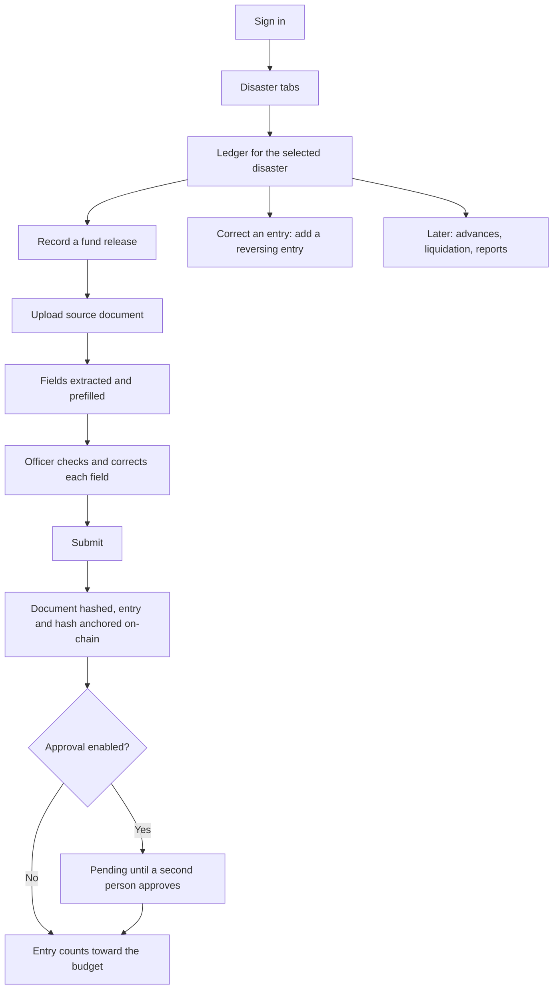

# Finance Officer User Flow (draft)

**Status: draft of a planned design. None of this is built.** For what the app does today, read [the current user flow](../../product/user-flow.md). Role background and open questions are in [finance-officer-responsibilities.md](finance-officer-responsibilities.md).

The Finance Officer works in the Financial Management Division of a DSWD Field Office and is the top role in AyudaChain's first version. Their workspace is a budget ledger per disaster. It records how much was received, for what purpose and for which area. It does not yet cover which families receive anything.

## Scope

| Flow | First version | Later |
|---|---|---|
| 1. Sign in | Deferred | Yes |
| 2. Choose a disaster | Yes | |
| 3. Record a fund release | Yes | |
| 4. Read the ledger | Yes | |
| 5. Correct an entry | Yes | |
| 6. Approve an entry | Design for it | Yes |
| 7. Grant a cash advance | | Yes |
| 8. Track liquidation and returns | | Yes |
| 9. Report and export | | Yes |

Declaring a disaster is out of scope. Disasters arrive in the system already declared; how they are created is not decided yet.

## Overview

## Flow 1: Sign in (deferred)

1. The officer signs in with an organisational account.
2. The system knows their Field Office and role, and shows only that office's disasters.

Until sign-in exists the role is a selectable setting, as today. Every action must still record which user did it, so that real identities can replace the placeholder later.

## Flow 2: Choose a disaster

1. The officer lands on a row of tabs, one per declared disaster their Field Office is responding to.
2. Each tab shows the disaster's name and its three headline figures: received, advanced, remaining.
3. Selecting a tab opens that disaster's ledger. Everything the officer does next applies to that disaster only.

**Rules**

- A disaster's data never mixes with another's. Budget, area and documents are all scoped to the selected tab.
- A disaster with no entries yet shows an empty ledger and a prompt to record the first release.

## Flow 3: Record a fund release

This is the core flow.

1. The officer chooses "Record a fund release" inside a disaster.
2. They upload the source document: the Sub-Allotment Release Order, and the Notice of Transfer of Allocation if they have it.
3. The system reads the document and prefills the form. Each prefilled field is marked as machine-read.
4. The officer checks every field against the document, shown side by side, and corrects any that are wrong:
   - Document type and reference number
   - Date issued
   - Amount
   - Purpose (for example, emergency cash transfer)
   - Covered area (provinces, cities or municipalities)
   - Signatory name and position as printed
5. The officer submits.
6. The system computes a hash of the file, stores the file off-chain, and anchors the hash, amount and disaster ID on-chain.
7. The entry appears in the ledger with its anchoring state.

**Rules**

- No document, no entry. The submit button stays disabled until a file is attached.
- Extraction only ever prefills. An entry is saved only after the officer has confirmed it.
- If the officer changes a machine-read amount, the entry records both values and that it was overridden.
- A document whose hash already exists in the system is rejected as a duplicate, to stop one release being counted twice.
- If anchoring fails, the entry is saved as "not anchored" and says so. It is never shown as anchored.
- The signatory is recorded as "named on the document". The system does not claim to have authenticated a handwritten signature or stamp.
- If the file carries a government digital signature, the system validates it and records the result separately as "digitally signed by".

## Flow 4: Read the ledger

1. The ledger lists every entry for the disaster, newest first: date, type, reference number, amount, purpose, area, entered by, anchoring state.
2. Three totals sit above the list:
   - **Received:** sum of fund releases.
   - **Advanced:** sum of cash advances to disbursing officers (zero until Flow 7 exists).
   - **Remaining:** received minus advanced, plus returns.
3. Opening an entry shows its document, its hash, its on-chain reference, and its history.
4. From an entry the officer can re-check integrity: the stored file is hashed again and compared with the anchored hash.

**Rules**

- Totals are computed from entries, never typed.
- An integrity check reports one of three results: matches, does not match, or could not reach the chain. An unreachable chain is not a match.

## Flow 5: Correct an entry

1. The officer opens an entry and chooses "Correct".
2. They state the reason and enter the right values, with a document if the correction comes from an amended release.
3. The system adds a reversing entry and a replacement entry. The original stays visible, marked as superseded.

**Rules**

- Entries are never edited or deleted. The ledger is append-only, which matches the audit trail rule in `AGENTS.md`.
- A reason is required for every correction.

## Flow 6: Approve an entry (design for it now)

1. A submitted entry is "pending" and does not count toward the remaining balance.
2. A second person, probably the Regional Director, opens it, compares it with the document, and approves or returns it with a reason.
3. Approval is itself anchored, with the approver's identity.

**Rules**

- Nobody approves their own entry.
- Until this flow is built, entries count immediately. Each one must still store "entered by" and an empty "approved by", so approval can be added without migrating data.

Who the approver is remains an open question.

## Flow 7: Grant a cash advance (later)

1. The officer picks a disbursing officer and an amount within the disaster's remaining balance.
2. The system checks the officer is bonded and the amount is within the allowed limit.
3. The advance is recorded, anchored, and deducted from the remaining balance.

This is where the budget ledger connects to payouts. It replaces the current app's "allocate to a barangay" step.

## Flow 8: Track liquidation and returns (later)

1. For each advance the officer sees cash advanced, payouts confirmed against it, and cash returned.
2. An advance is settled when payouts plus returns equal the amount advanced.
3. Advances that are overdue or do not balance are listed first.

This is the reconciliation an auditor will read, so it should be computed automatically from payout records, not entered by hand.

## Flow 9: Report and export (later)

1. The officer exports a disaster's ledger and totals for Central Office or the resident auditor.
2. The export includes each entry's document hash and on-chain reference so a reader can verify it independently.

## Screens implied

| Screen | Purpose |
|---|---|
| Disaster tabs | Switch between declared disasters, with headline figures |
| Ledger | Entries and totals for one disaster |
| Record a fund release | Upload, review prefilled fields beside the document, submit |
| Entry detail | Document, hash, chain reference, history, integrity check |
| Correction form | Reason and replacement values |
| Approval queue (later) | Pending entries for the approver |
| Advances and liquidation (later) | Per-officer cash position |

## Open questions

1. Who creates a disaster record, given that declaring one is out of scope?
2. Who approves entries, and from which version?
3. Is covered area set per release or per disaster?
4. Which file types are accepted: scanned PDF, photo, digitally signed PDF?
5. How long must documents be retained, and where are they stored?
