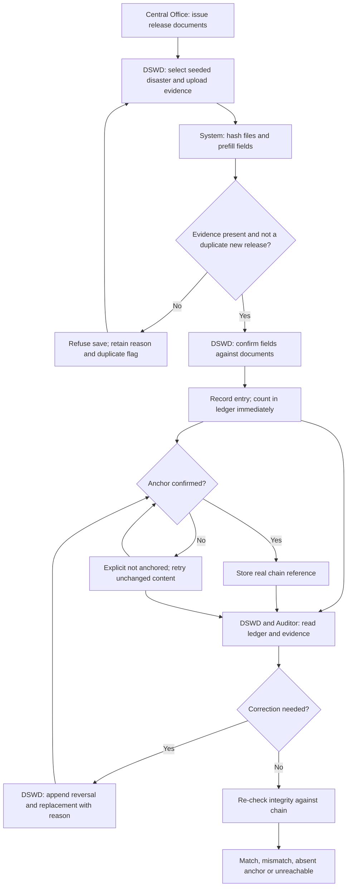
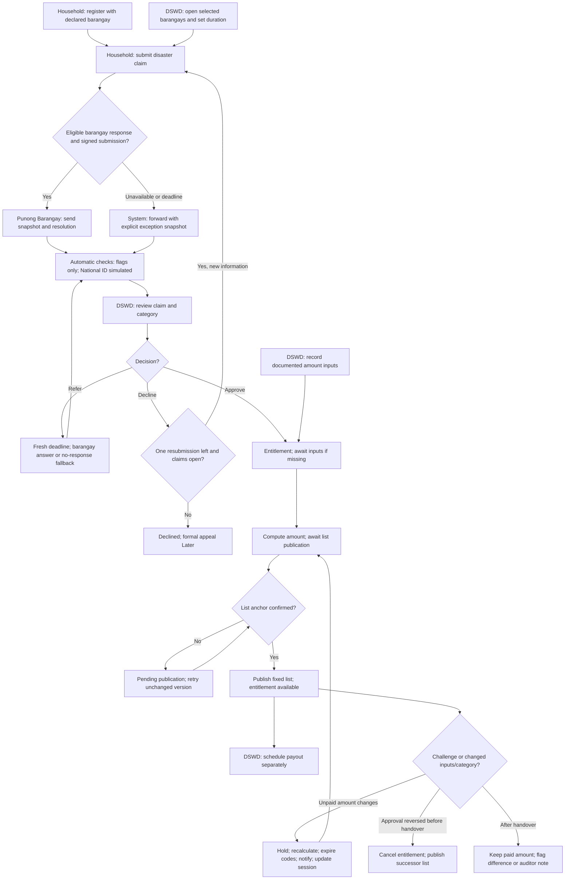
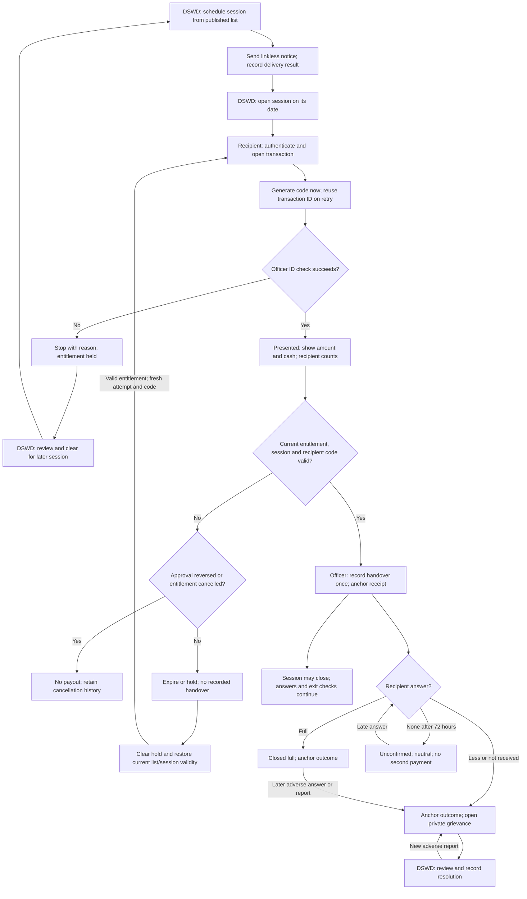

# End-to-end process: AyudaChain redesign

**Status: Decided ideation, not built.** Confirmed in the process grilling session of 2026-10-08 to 2026-10-09. This describes the planned five-role process, not version 1 or the running application. It grants no permission to implement it. Decisions are indexed in [section 16 of the decisions record](decisions-2026-10-08.md#16-end-to-end-process-2026-10-09).

This follows a fund release, a claim and a payout across the DSWD Officer, Barangay Officer, Beneficiary, Disbursing Officer and Auditor. It defines actors, handoffs, logical stores and state changes so a high-level Data Flow Diagram can be drawn next. The Mermaid diagrams are process flows, not that DFD; no screens are designed here.

**Reading rule: Decided.** Every flow step, state transition and rule below is **Decided** unless explicitly marked **Proposed** or **Later**. A decision here settles this draft, not whether a feature is ready to build. The existing product is documented in [the current user flow](../product/user-flow.md). `docs/product/prd.md` was absent during this session; the maintainer's brief and the listed ideation documents govern this document.

## Scope and common rules — Decided

- One DSWD Field Office, emergency cash paid directly by DSWD, one entitlement and at most one recorded handover per household per disaster. Several sessions and pre-handover attempts are possible. Separate assistance for independently living families sharing a household is **Later**.
- Disasters and DSWD/Auditor accounts are seeded. Declaring a disaster and managing those staff accounts are outside this process. Opening claims is an explicit DSWD action on a seeded disaster and selected barangays; recording a release does not open claims.
- A Barangay Officer offers an attestation and category opinion. A DSWD Officer decides eligibility and category. A Disbursing Officer records cash handover. The Auditor reads and re-checks, and changes no business record.
- Checks flag records for human review; they never approve, decline, reverse an approval or award another payment. The National ID check is a **simulated stand-in**, labelled in the UI and API response. No live PSA or DSWD dataset integration is claimed.
- Every committed state change appends an `audit_events` entry with actor, time, record/version, action and reason where required. Responses, decisions, corrections, list versions, attempts and closing answers are never overwritten. Draft form editing is not a saved ledger entry or claim decision.
- Personal information, documents, receipt contents, reasons and secrets stay off-chain. Chain records contain only hashes, opaque identifiers and, for fund entries, the recorded amount and disaster identifier. Hashes commit actual saved content; they are never fabricated.
- Business state and anchoring state are separate. An approved claim is a human decision, not a claim that the chain verified it. A recorded handover is not proof that the recipient received the full amount.
- Authentication is a prerequisite for the future five-role process and server enforcement. It remains absent from version 1. Phone signup/sign-in is **Proposed planning only**; provider, feasibility and free-tier availability are unresolved. No SMS authentication implementation is assumed.

## Logical data stores — Decided

These names identify information boundaries for the next DFD. They do not prescribe database tables, a schema migration, a storage vendor or an existing implementation.

| Store | Contents |
|---|---|
| S1. Disasters and claim operations | Seeded disasters; selected barangays; recorded external authority/basis; claim opening/closure; endorsement duration and each deadline |
| S2. Accounts and credentials | Seeded DSWD/Auditor accounts; documented Barangay Officer nominations, positions and approval; Disbursing Officer accounts; role/active status; credential references and hashed assisted PINs |
| S3. Household registry | Household identity, members, address and declared barangay; residence confirmation/dispute; identity evidence/field-check status; contact and account linkage; who assisted registration; prior versions |
| S4. Claims and review | Submitted registry/claim versions; damage description/category/evidence references; response threads; conflict declarations; check results; referrals, decisions and one-resubmission history |
| S5. Batches and approved lists | Immutable signed barangay snapshots, council-resolution references, clearly labelled system fallback snapshots, approved-list versions and their private contents |
| S6. Amount inputs and entitlements | Documented input versions, mode and category basis; final category and computed amount/version per entitlement; publication/hold/handover links; paid differences |
| S7. Sessions and transactions | Session date/site, assigned officers and list versions; appended scheduling amendments; transaction ID, attempts, code verification data, step times, ID-check result, handover receipt, outcomes and notes |
| S8. Challenges and grievances | Private reports, linked claim/transaction, evidence references, status, review notes and resolution history |
| S9. Funds ledger | Release entries, source references, extraction/confirmed values, signatories, correction sets and computed totals |
| S10. Private file store | Release documents, council resolutions, amount-input documents, identity photos and damage evidence; immutable versions. References, hashes and access metadata are held with their application records |
| S11. Audit events and anchor work | Append-only business-action history; required anchors, immutable content references, submission/receipt references and retry history |
| S12. Auditor access log | Views and integrity-check access, including every ID-number/photo view. Written by the system and hidden from the Field Office |
| S13. Notifications | Recipient, purpose, record/version reference, channel, delivery attempt/result and failures. Contains no sign-in secret or advance payout code |

**Access rule: Decided.** S10 is private, not a public upload directory. Access follows the permissions of the linked record. The barangay can see damage evidence relevant to its claims, but never identity photos, ID numbers, phone numbers or amounts. Auditor access is broad but logged in S12, not in a Field Office-visible log of which records were inspected. The file provider, supported formats, backup/retention policy and operational implementation are **Later**.

## Flow 1: fund release — Decided

### Steps

Every committed write below also appends S11, except the Auditor's reads, which append S12. “Anchor” identifies a planned chain commitment, not an already implemented contract function.

| Step / actor | Trigger; received from | Handed on; to whom | Record/state and stores touched | Anchor |
|---|---|---|---|---|
| F1. Central Office; outside the app | An authorised release; approved funding instructions from the real DSWD process | Sub-Allotment Release Order and available NTA/supporting documents to the Field Office; cash authority/instructions to the government bank | External authority and bank records only; no app entry yet | None |
| F2. DSWD Officer | Receives F1 evidence; selects the seeded disaster from S1 | Uploaded evidence to document-reading/ hashing components; a draft release for their own confirmation | Read S1; write S10 and draft/source metadata in S9. Compute file hashes on upload; no ledger total changes | None on upload |
| F3. System, then DSWD Officer | F2 upload | Extracted fields, words/figures warning and duplicate result to the officer; officer-confirmed amount, purpose, covered area, references, dates and signatories to the ledger | Read S9/S10; preserve machine-read and confirmed values in S9. Missing evidence blocks saving. A duplicate offered as a new release is refused and logged/flagged in S11 | None until confirmation |
| F4. DSWD Officer; system saves | Officer confirms F3 | Recorded entry, totals and explicit anchoring state to DSWD and the Auditor | S9: draft → recorded; entry counts immediately. Store entered-by and empty approved-by. S11: pending anchor | File hashes and release-entry commitment, recorded amount and opaque disaster/entry identifiers |
| F5. Anchor component | F4 or a retry of exactly that saved version | Confirmed chain reference or failure to the record and exceptions view | Read immutable S9/S10 content; append S11 submission/result. Business entry remains recorded whether anchoring succeeds or fails | The F4 content; never a fabricated success |
| F6. DSWD Officer or Auditor | Browses an entry or requests an integrity re-check | Evidence, history and match/mismatch/absent-anchor/unreachable result to that reader | Read S9/S10/S11 and chain. Auditor access appends S12; it changes no ledger entry | Chain read only |
| F7. DSWD Officer | Finds an error or receives an amended release document | Reason, linked reversal and replacement to the ledger; correction evidence to the Auditor | Append one correction set to S9/S11; add S10 evidence if amended. The original is derived as superseded, not edited. Totals cancel the original and count the replacement once | Reversal/replacement commitments and any new supporting-document hashes |
| F8. System; Auditor reads | Any recorded entry/correction | Received, advanced and remaining figures to DSWD/Auditor | Read S9; totals are computed, never typed. Payout totals are read separately from S7 | None for a computed view |

**Release rules: Decided.** Extraction only prefills. If extraction fails, the officer still checks and enters values against the source; there is no unattended save. Words/figures disagreement warns rather than blocks. Printed names, handwritten signatures and stamps are recorded as printed evidence, not authenticated identities. A validated digital signature is labelled separately. A release can have area breakdown lines and several supporting files, but the NTA is not counted as another release merely because it is another document.

**Correction exception: Decided.** An ordinary transcription correction references the original evidence through its linked correction set. It does not need a newly invented document or count the old file as a second release. A change to the underlying release needs its amended evidence. Reversal and replacement are saved as one correction operation so there is no intermediate double-counted balance; partial chain failure remains visible per required commitment.

**Financial boundary: Decided.** Received is the net total of recorded releases after correction sets. Advanced is zero until advances exist; returns likewise have no implemented feeding event. Remaining follows the ledger formula, received minus advanced plus returns, and currently equals net recorded releases. It is **not certified available cash or a reconciled bank balance**. Recorded handovers do not silently become advances or subtract from this ledger. Current approved entitlements, including locked handed-over amounts, are totalled separately; exceeding the ledger balance warns and does not block. Certifying funds, advances, returns and liquidation remain **Later**. Physical funding is an outside Accounting/Cash operation.

### Release states and allowed moves

| Move | Who may make it | Condition |
|---|---|---|
| No entry → draft | DSWD Officer | Select a seeded disaster and attach source evidence |
| Draft → recorded | DSWD Officer confirms; system saves | Required fields/evidence present; not a second release using the same document |
| Recorded → superseded | DSWD Officer | Append reason, reversal and replacement as a linked correction; never mutate the original |
| Replacement recorded → superseded | DSWD Officer | Another complete correction set; full history retained |

There is no editable/deleted release state. Pending second-person budget approval, return-for-correction and approval actors are **Later** and not active transitions here. Each saved version also has the independent anchoring states in the common anchoring section.

## Flow 2: claim — Decided

### Preparation and steps

| Step / actor | Trigger; received from | Handed on; to whom | Record/state and stores touched | Anchor |
|---|---|---|---|---|
| C1. Punong Barangay outside the app; DSWD Officer enters | A documented nomination by the Punong Barangay, including initial accounts | Named candidate, actual position and nomination evidence to DSWD for approval; active account to the nominated person | S2 nomination → active or remains pending; S10 evidence; S11 action. Nominator, entered-by and approver are distinguished. DSWD approves/deactivates | None independently |
| C2. Beneficiary; or Barangay Officer assisting | Household wants to register, even before a disaster | Identity, members, address, declared barangay and contact to S3; registration result to household | S2/S3/S10/S11. Residence begins unconfirmed. Record assister; assisted registration is flagged. Identity may remain pending field check | None independently |
| C3. DSWD Officer | Receives external operation authority/basis and coverage; chooses a seeded disaster and barangays | Open claim operation and endorsement duration to households/barangay; later closure notice | Read S1/S9; append S1/S11 opening/basis/coverage. Uploaded basis uses S10. Release coverage informs but does not automatically open claims | None independently |
| C4. Beneficiary | Registered household; C3 operation open for its declared barangay | Disaster claim, stated category, damage description and evidence to barangay response queue | S4: submitted/waiting for barangay. Reference the submitted S3 version; S10 evidence; S1 deadline; S11. Closing claims stops new claims, not review of existing ones | None independently |
| C5. Eligible Barangay Officer | Receives C4 or a fresh DSWD referral | Endorsed/not-endorsed response, category opinion, required reasons, optional damage evidence and relative declaration to the claim; attestation, category opinion/reasons and officer name to household | Append S4 response thread and S11; S10 optional evidence. Positive residence attestation informs S3 residence confirmation. Never alter the household's final category | Included when a snapshot commits that response version; no separate response anchor |
| C6. Punong Barangay's active account | Responded claims ready; uploaded council resolution | Fixed signed batch to DSWD | S5 submitted snapshot of claim/response versions, sender/time and resolution; S10 file; S11. Only the Punong Barangay sends this kind of batch | Signed batch hash and resolution hash |
| C7. System fallback | No eligible endorser; or deadline reached without response or submission | Claim and available responses directly to DSWD, with the exact exception | S4 → DSWD queue; S5 labelled system snapshot; S11. No fake sender, signature or council resolution. A responded but unsent claim retains its actual response plus no-barangay-submission flag | Labelled fallback snapshot hash |
| C8. Automatic-check component | Receives C6/C7, a referral answer, or a permitted resubmission | Duplicate/near-match flags, simulated National ID result and risk order to DSWD | Read S2/S3/S4/S6/S7; append versioned results in S4/S11. All matching data is within the one Field Office's AyudaChain records | No independent check anchor |
| C9. DSWD Officer | Claim and C8 results in shared queue | Approve with final category, decline with reason, or refer with question to barangay; outcome/reason to household and decision to barangay | Append S4 decision/S11; decision-maker and empty confirmed-by. Approval creates one S6 entitlement for the household/disaster, awaiting amount if necessary. Own-household decisions require another DSWD officer | Approval later committed in the approved list; no standalone decision anchor |
| C10. Barangay Officer; system on timeout | DSWD referral with a new deadline | Answer/new response to DSWD; or explicit no-barangay-response outcome | Append S4/S11; return to C8/C9. Earlier batch/response remains intact. A referral may be answered after claims close | New fallback snapshot if timed out; no standalone reply anchor |
| C11. Beneficiary | Declined claim; new information; claims still open | One linked resubmission through the barangay again | Append S4 submission version and resubmission count, S10 evidence, S1 fresh deadline and S11; return to C5–C9 | Through the new signed/fallback snapshot, as applicable |
| C12. DSWD Officer | Documented amount basis from the authorised operation, including LGU-agreed duration where applicable | Confirmed mode/input version to the calculator, households and Auditor | S6/S10/S11; calculate approved entitlements. No officer enters a household-specific amount. First publication locks the input version | Input-version commitment and supporting-document hashes |
| C13. DSWD Officer; publication component | Approved claims have final categories and computed entitlements | Fixed approved-list version to confirmed residents and barangay; own entitlement/amount/basis to each household; full evidence to Auditor | S5/S6/S11; ready → pending publication → published/available only after the list anchor is confirmed. Publication is not the payout-session notice | Approved-list version hash |
| C14. Confirmed resident; DSWD Officer reviews | Resident challenges an entry from their own barangay's published list | Private challenge to DSWD; decision to affected household; evidence to Auditor | S8/S4/S6/S11. Before handover, a substantiated challenge can append approval reversal, cancel entitlement and invalidate attempts. Publish a new list version. After handover, retain a note for Auditor; no payment reversal | Revised list hash before handover; no standalone challenge anchor |
| C15. DSWD Officer; calculator | Documented correction of amount inputs, or category change with reason | New unpaid entitlement versions and old/new notices to households; paid difference flags to DSWD/Auditor | S6/S10/S13/S11. Hold affected unpaid entitlements, expire old attempts/codes in S7. DSWD republishes S5 and appends affected session amendments in S7 before another handover | New input/document commitments when inputs change, and revised list hash |
| C16. Auditor | Reads claims, changes, flags or challenges | Integrity/evidence assessment to their own read-only view | Read permitted S1–S11; append S12 access. No claim or grievance decision | Chain reads only |

**Endorsement routing: Decided.** DSWD sets a response duration per disaster. Each submitted claim starts its own recorded deadline; each referral starts a fresh one. Fewer than two active Barangay Officers prevents endorsement and routes the claim as no eligible endorser, with the staffing reason. Conflicts are assessed per claim: own household and a household the officer registered bar responding; another relative requires declaration and a flag. Not endorsed is an opinion, not a rejection. A missing response and a missing signed submission are different exceptions. Responded claims that the Punong Barangay does not send are forwarded at the deadline, preserving their responses. None of these paths can be vetoed by the barangay.

**Response history: Decided.** Withdrawal/reversal is a reply, with reason, not an edit. The response thread stays open until a final approval or decline; a referral does not close it. A late answer during review appends evidence and requires re-check/review; it never changes a fixed batch. After a final decision the barangay cannot add a response. There is no formal appeal flow; one new-information resubmission after decline is allowed while intake is open. A new submission version starts another response thread and deadline, without erasing the decline.

**Checks and decisions: Decided.** Five duplicate checks cover a person in two households, an ID used twice, a phone shared above three households, an already-approved/handed-over household for this disaster, and aid recorded in another barangay for the disaster. Names/addresses include near-matches. Phone sharing above three flags, not automatic refusal. Bulk approval is available only for endorsed, unflagged claims with an undisputed category. All other claims receive individual human review. Checks are called automatic checks, not AI. Outside database matching and a model remain **Later**.

**Residence and identity: Decided.** A declared barangay routes intake; it is not proof of residence or permission to read a residents' list. Positive barangay residence attestation or a documented DSWD residence check confirms it. DSWD may check residence independently of an aid claim. A new residence dispute suspends residents-list access pending DSWD review, without automatically declining the claim. Correcting established facts requires a new recorded version and review; it does not silently rewrite submitted claims or snapshots. No-ID households may register and claim, but payment waits for a documented DSWD field check and an accepted government photo ID. Certification-only payment is **Later**. The barangay does not authenticate identity. DSWD, never the barangay, may re-link a lost-phone account after an ID check, with history retained.

**Amount and publication: Decided.** Approval establishes eligibility even if inputs are missing. Such an entitlement has no payable amount yet. One disaster uses the documented wage formula or fixed amounts by category. The formula is `ceil((0.75 × applicable daily wage) / 10) × 10 × category days`; it does not fetch a changing wage automatically. Every input needs evidence. Residents' list columns are name, zone and category, with no amount, ID or phone. The private list commitment identifies the approved claim/decision, category, entitlement and input versions; the household separately receives its own computed amount and basis. A successor list carries forward still-approved entries from earlier batches; earlier versions remain visible as history and cannot alone authorise payment. A session's original list records assignment context: handover also requires that same entitlement version in the current published list. Adding other households does not invalidate an unchanged entitlement's code; adding/changing that session's payable households requires a DSWD-recorded session amendment.

**Changed inputs/category: Decided.** New documented inputs recalculate every entitlement without a recorded handover, including open or stopped attempts. Only DSWD changes an approved category, with reason. The household receives old/new amount history, even if it already has a session notice. An affected entitlement is held until a new list version is published and its session reference updated; previous codes/attempts cannot authorise the old figure. Recorded handovers retain their original entitlement/amount versions; differences are flagged as shortfall/overpayment for human handling, not automatically paid or recovered.

### Claim and supporting states and allowed moves

| Claim move | Who may make it | Condition |
|---|---|---|
| No claim → waiting for barangay | Beneficiary submits | Registered household; operation open for declared barangay |
| Waiting for barangay → awaiting DSWD | Punong Barangay sends, or system forwards | Signed batch or explicitly labelled exception snapshot |
| Awaiting DSWD → referred back | DSWD Officer | Append question and fresh deadline |
| Referred back → awaiting DSWD | Eligible Barangay Officer answers; system routes, including on timeout | Append reply or explicit missing-response fallback; rerun checks |
| Awaiting DSWD → approved | DSWD Officer | Final category; one linked entitlement, even if amount is pending |
| Awaiting DSWD → declined | DSWD Officer | Required reason |
| Declined → waiting for barangay | Beneficiary | Once only, with new information, while claims are open; new version/thread |
| Approved → approval reversed | DSWD Officer | Substantiated pre-handover challenge, reason and new entry; publish revised list |

The claim remains approved after handover; the entitlement and transaction carry payment state. Category changes append a decision/version while preserving that eligibility state. There is no automatic rejection move from a flag and no implemented formal appeal or automatic reapproval of a reversed claim.

| Supporting record / allowed moves | Who | Condition |
|---|---|---|
| Claim operation: not open → open → closed | DSWD Officer | Record barangays, authority/basis and duration; closure stops new claims/resubmissions only |
| Nomination/account: pending → active → deactivated | DSWD Officer | Documented nomination; position stored; deactivation preserves history |
| Registry residence: unconfirmed → confirmed or disputed; confirmed → disputed; disputed → confirmed | Eligible barangay attestation within an open response thread or DSWD review; DSWD resolves disputes | Keep evidence/actor/version history; current confirmation is required for residents-list access |
| Response: no response → endorsed/not endorsed; response → withdrawn/reversed/new reply | Eligible Barangay Officer | Required reasons for negative/disputed/changed opinion; until final claim decision |
| Signed batch: draft → submitted fixed snapshot | Punong Barangay | Council resolution attached; sender authorised |
| System intake: absent → forwarded fixed snapshot | System | Explicit deadline/staffing/submission exception; never a signed batch |
| Approved list: ready → pending publication → published; published → historical | DSWD initiates; system confirms anchor; DSWD publishes successor | All included amounts computable; immutable versions; failed anchoring leaves publication pending |
| Entitlement: awaiting amount → awaiting publication → available | Calculator after DSWD input confirmation; DSWD publishes | Current input/category and confirmed list anchor |
| Available → in transaction → handed over | Beneficiary opens; Disbursing Officer records handover | Current eligible session; valid ID/code; at most one handover |
| Available/in transaction → held or awaiting publication | System following a recorded stop or DSWD change | Identity review, changed basis, expired/stale authorisation or other explicit hold; no handover yet |
| Held → available | DSWD clears the issue; system checks prerequisites | Valid evidence, current published entitlement and assigned session; stopped payouts go to a later session |
| In transaction → available | System expires an unused attempt | Only if entitlement remains eligible/current; otherwise retain its hold |
| Unhanded entitlement → cancelled | DSWD Officer | Append pre-handover approval reversal; never cancel a handed-over entitlement |

Published rows are history, not a mutable claim status. A missing amount is not zero. “Available” is a valid entitlement, not certification of physical funds.

## Flow 3: payout — Decided

### Steps

| Step / actor | Trigger; received from | Handed on; to whom | Record/state and stores touched | Anchor |
|---|---|---|---|---|
| P1. DSWD Officer; outside Accounting/Cash parties | Published current list from C13; outside arrangements for cash and site | Scheduled session with disaster, barangay, date, site, named officers and published-list version to assigned officers; notification request to system | Read S5/S6; append S7/S11. Funding/cash transport is external, not an advance entry. Assisted payouts need two eligible officers | No standalone session anchor |
| P2. Notification component; SMS service | P1 scheduling or an appended change/cancellation | Linkless payout notice to recorded household contact; own session information through account; delivery result to DSWD | Read S3/S7; append S13/S11. Failure remains visible. DSWD arranges notice outside the software for households without usable SMS contact | None |
| P3. DSWD Officer | Scheduled date and operational readiness | Open session authority to assigned Disbursing Officers and households | Append S7/S11 scheduled → open. Real funding/site readiness is outside software certification | None independently |
| P4. Beneficiary | Authenticated household; open session; current published and unhanded entitlement | One transaction ID and short-lived one-time code to the recipient; opened transaction to assigned officer | Read S2/S5/S6/S7; append S7 attempt and S11. One active attempt, one entitlement/transaction ID. Generate code only now; store verification data, never log its secret | None at opening |
| P5. Disbursing Officer | P4 transaction; recipient presents accepted ID | ID-check result and computed current amount to transaction and recipient | Read permitted identity fields in S3, S5–S7; append S7/S11 open → presented if successful. The officer cannot pay own household | No independent ID-check anchor |
| P6. Disbursing Officer; DSWD Officer reviews | ID check fails | Stopped attempt/reason to DSWD and household; review result for later session | Append S7/S11 stopped; S6 held, not cancelled. DSWD reviews S3/S4/S7 and may clear for a later session. Preserve the transaction ID | No pre-handover stop anchor; audit history retained |
| P7. Recipient; Disbursing Officer | Successful P5; officer presents cash; recipient counts it | Recipient releases code to officer; officer submits code to record handover and hands over cash | Recheck S5/S6/S7 approval, amount/version, session/date/assignment and code. Append S7 handover receipt/S11; S6 handed over; consume code. Never type amount | Handover receipt hash, linked through opaque transaction/entitlement references |
| P8. Beneficiary on own device; independent exit checker for assisted path | Recorded handover | Received in full/received less/not received answer to private transaction history; result to household, DSWD and Auditor | Append S7/S11 outcome. An adverse answer creates or reopens S8 grievance. Paying officer receives no private answer/grievance | Outcome-event hash |
| P9. System | 72 hours after P7 without answer | Neutral unconfirmed outcome and exception to DSWD/Auditor | Append S7/S11. Entitlement remains handed over; no automatic repayment or penalty | Unconfirmed-outcome hash |
| P10. Beneficiary; independent exit checker for assisted path | Late answer or revised answer/report, including after session closure | New outcome version to S7; private grievance intake/follow-up to DSWD | Append S7/S8/S11; never erase an answer or prior grievance resolution. New adverse evidence reopens a closed linked grievance | New outcome-event hash when answer changes; grievance notes have no standalone anchor |
| P11. DSWD Officer | Grievance received or reopened | Review/status/notes and recorded resolution to household; full record to Auditor | Append S8/S11 open → under review → closed. No software decision that cash was received, and no handover reversal | None independently |
| P12. DSWD Officer | End of session, cancellation, or schedule amendment | Closed/cancelled/amended session to officers and households; outstanding unhanded entitlements to later scheduling | Append S7/S11; invalidate pre-handover attempts/codes; S6 remains available or held according to reason. Append S13 changed/cancelled notices | No standalone session anchor; existing receipts remain anchored independently |
| P13. System; DSWD and Auditor read | Each handover/outcome/change | Separate handover, full-confirmation, disputed and unconfirmed totals; barangay gets approved/paid/remaining counts only | Read S5–S8; totals derived. Auditor access appends S12. S9 ledger is not changed by a payout | None for computed totals |

**Identity and code: Decided.** The recipient counts the cash before revealing the code. No code means no recorded handover. That code is not a sign-in credential and is never sent with a notice. The server enforces actor/order, current approval and entitlement version, assigned session/date, recusal, unused code and one-handover limit. A session snapshot cannot authorise an entitlement that was reversed or changed after it was attached. If the recipient refuses to authorise, the attempt remains pre-handover and can expire; a private report can still go to DSWD.

**Assisted path: Decided.** A recipient without a phone uses their accepted ID and privately established PIN on the officer's device. Identity checking precedes private PIN setup; the PIN is hashed and never sent by text or recorded in audit history. The recipient authorises opening and handover; the paying officer does not supply their own code or answer. A second eligible Disbursing Officer assigned to the same session records the recipient's exit answer. They must differ from the payer and must not be from the recipient's household. If no independent staff member is available before payment, hold/schedule later rather than bypass the control. An unexpected missing exit check after handover leads to follow-up/unconfirmed, not undoing cash. DSWD may append a replacement eligible officer assignment for follow-up.

**Other access paths.** Using the assisted path for someone with a registered phone, with a recorded reason, remains **Proposed**. The basic-phone transaction-by-text protocol is **Later**; sending a payout notice does not establish a sign-in or reply-authentication mechanism. Phone signup/sign-in remains **Proposed planning only**, including unresolved integration/free-tier feasibility. Google sign-in, representatives, and additional payout tranches remain **Later**.

**Session closure: Decided, narrows 15.2.** DSWD alone schedules, opens, closes, cancels and appends session changes. Cash actions require an open session on its date. Closing/cancelling expires unused attempts/codes. Recipient answers, independent assigned exit checks and notes may continue after closure; closure is not liquidation or confirmation of every payment. Stopped payouts require DSWD clearance and a later session. Other unused/expired attempts may be opened again with the same ID when the entitlement and assigned session are valid; each attempt and fresh code is retained in history.

**Receipt and totals: Decided.** Recorded handover consumes the entitlement regardless of the later answer. It fixes the original amount for paid-difference calculations and counts once in the session's recorded-handover total and barangay paid count. Received in full, adverse receipt and unconfirmed are separate outcome measures, not assertions that every handover was successful. Only waiting after handover becomes unconfirmed; abandoned open/presented attempts do not. A recipient can answer or amend later, without authorising another handover. Payment of a shortfall, recovery of an overpayment and accounting liquidation are **Later** human processes, not automatic grievance outcomes.

**Private grievance: Decided.** Received less/not received opens one linked grievance per transaction; a later adverse report reopens that record if closed. The original answer, resolution and reopening remain. A later full-receipt answer does not automatically close the grievance. DSWD records status, notes and what was done; the Auditor sees all. The barangay and paying officer see neither complainant information nor private answers. An exit checker necessarily receives the answer they record, but gains no grievance-management access. A post-payout list challenge is evidence for the Auditor, not authority to reverse cash.

**Connection: Decided.** There is no offline payout or queued handover. The paying officer provides a working connection. If a request acknowledgement is lost, read the same transaction's server state before any retry; do not infer that handover failed or pay again. If the physical exchange is disputed, preserve the recorded event and refer it through the grievance/exception route. Anchoring failure after handover does not make the entitlement payable again.

### Payout states and allowed moves

| Transaction move | Who may make it | Condition |
|---|---|---|
| No transaction / cleared / expired → open | Beneficiary authorises; assisted opening uses recipient ID/PIN | Current published entitlement and open assigned session; reuse existing ID after an earlier attempt; a stopped attempt must first be cleared by DSWD for a later session |
| Open → presented | Assigned Disbursing Officer | Valid accepted ID/person comparison; eligible payer |
| Open/presented → stopped | Assigned Disbursing Officer | Failed identity check; required reason; no handover |
| Stopped → cleared for later session | DSWD Officer | Review/identity evidence; entitlement remains valid; never erase stop history |
| Open/presented → expired | System | Code expiry, session close/cancellation, or DSWD-recorded change/reversal; retain precise reason |
| Presented → handed over | Assigned Disbursing Officer, with recipient's code | Current eligibility/amount/session and successful code check; atomic once-only recorded consumption |
| Handed over → closed: full / less / not received | Beneficiary; independent assisted exit checker records recipient's answer | Private answer; adverse answers open linked grievance |
| Handed over → unconfirmed | System | No answer 72 hours after recorded handover; neutral |
| Unconfirmed → closed: full / less / not received | Beneficiary; independent assisted exit checker | Late answer allowed, including after session closure |
| Any closed answer → new closed-answer version | Beneficiary; independent assisted exit checker records recipient's amended answer | Preserve previous answers; adverse report creates/reopens grievance; no additional handover |

There is no handed-over/closed/unconfirmed → open, stopped or unpaid move. Codes and pre-handover attempts may expire; a recorded handover does not. The exact short-lived code lifetime is **Proposed implementation policy**, not the 72-hour receipt-answer window.

| Supporting record / allowed moves | Who | Condition |
|---|---|---|
| Session: absent → scheduled → open → closed | DSWD Officer | Published list, date/site and eligible officers; funding/site arrangements are external |
| Session: scheduled/open → cancelled | DSWD Officer | Reason and notifications; preserves handovers and follow-up |
| Session: scheduled/open → amended version in same state | DSWD Officer | Preserve prior date/site/assignments/list references; invalidate affected attempts and notify; no retroactive handover edit |
| Closed session → appended follow-up assignment/note | DSWD Officer assigns; authorised Disbursing Officer notes/checks | No reopened cash actions; another session pays remaining entitlements |
| Grievance: absent → open | System from beneficiary answer/report | One linked transaction grievance; private routing |
| Grievance: open → under review → closed | DSWD Officer | Record notes and human resolution |
| Grievance: closed → open | System from beneficiary's new adverse answer/report | Append reopening; preserve resolution |

## Anchoring and integrity — Decided

### Consolidated commitments

| Commitment | When / initiating actor | Off-chain evidence and chain contents |
|---|---|---|
| Fund-release entry and each supporting document | DSWD confirms/saves release | S9 entry and S10 files; hashes, opaque entry/disaster references and recorded amount |
| Reversing/replacement entries and amended evidence | DSWD saves linked correction | Immutable correction contents and evidence references; hashes and opaque linkage, with recorded amounts. Reused original evidence is referenced, not counted twice |
| Amount-input version and its documents | DSWD confirms documented inputs, including a later change | S6 version and S10 evidence; hashes and opaque version/disaster references |
| Signed barangay batch and council resolution | Punong Barangay sends snapshot | S5 private snapshot and S10 resolution; hashes and opaque references, never names/signatures in plain text |
| System fallback snapshot | System forwards a claim under C7/C10 | Actual S5 exception snapshot; hash and opaque reference. Clearly identified as system routing, never barangay endorsement |
| Approved-list version | DSWD requests publication; publication completes only after confirmed anchor | S5 immutable private snapshot of approved claim/decision, category, entitlement and input versions; hash and opaque version/barangay/disaster references |
| Handover receipt | Assigned Disbursing Officer records P7 using recipient code | S7 receipt with amount/input/list versions, actors, session and time held privately; receipt hash and opaque references. No code, PIN or identity data |
| Outcome event: answer, unconfirmed, late answer or amended answer | Recipient/independent exit checker answers, or system records 72-hour timeout | S7 immutable outcome version; hash and opaque linkage to transaction/prior event. Private answer itself remains off-chain |

**No standalone anchor: Decided.** Household registration, nominations/accounts, operation opening, individual response/reply/check/decision events, challenges/grievance notes, session changes, pre-handover stops/expiry, notification delivery and access logs stay off-chain. Relevant claim/response/decision versions are committed through batch/list snapshots, not presented as individually anchored. Their absence from the chain is not a failed required anchor. Audit observations and budget-approval/advance commitments are **Later**, outside this active list.

**Compatibility boundary: Decided.** This is the logical commitment inventory, not a definition of hash serialization, new contract functions or storage. No existing receipt payload or contract artifact changes in this documentation task. Implementation must separately resolve compatibility and obtain the repository-required decisions/ADR for any payload or contract change.

### Independent anchor states and allowed moves

| Move / verification result | Actor | Rule |
|---|---|---|
| Saved commitment → pending | System | Immutable content identified; no claimed chain hash/transaction success yet |
| Pending → anchored | Anchor component | Real successful chain operation and matching stored commitment confirmed; store actual reference |
| Pending → not anchored | Anchor component | Failed submission/confirmation; retain error/attempt and saved content |
| Not anchored → pending | Anchor component retries | Same immutable content; check prior submission/state first to avoid duplicate records |
| Match | Integrity reader/component | Stored content rehashed; hash actually read from chain and equal |
| Mismatch | Integrity reader/component | Read succeeded; current content differs from anchored hash |
| Anchor absent | Integrity reader/component | Read succeeded; required commitment not found. Do not call it verified |
| Chain unreachable | Integrity reader/component | Read could not complete; not proof of match or absence |

Missing/unreadable off-chain evidence is explicitly unavailable and cannot be verified. A historical successful check does not substitute for a failed current check. All required commitments can fail independently; partial correction/document anchoring stays visible. Retry does not resave the release, republish a different snapshot, consume another code or hand over cash again. An approved list stays pending publication until its anchor is confirmed; fund entries and already recorded handovers remain recorded with the explicit failure.

## Exceptions and loops — Decided

| Situation | Route / responsible actor | What remains true |
|---|---|---|
| Missing/duplicate release evidence or extraction failure | DSWD supplies evidence or manually confirms fields; duplicate-new-release attempt refused/logged | No unattended entry or double-counted release |
| Release error | DSWD adds linked reversal/replacement, then anchors each required commitment | Original evidence/history remains; corrected total counts once |
| Not endorsed | Include reason in signed batch or deadline fallback; DSWD reviews | Barangay opinion cannot reject the claim |
| No response, fewer than two active officers, or all barred | System routes with exact missing-response/eligible-endorser exception | No fabricated attestation; DSWD decides |
| Responses exist but no Punong Barangay submission/resolution | Deadline fallback preserves responses and flags missing submission | An unsigned system snapshot is never labelled a signed batch |
| Referred back, even after intake closure | Fresh deadline; answer returns through checks; timeout returns with explicit no response | Existing claim continues; no new-intake right is implied |
| Declined | Household may resubmit once with new information while claims open | Earlier decline remains; formal appeal is Later |
| No eligible DSWD reviewer, payer or assisted checker | Hold and escalate to DSWD staffing; append later assignment/session | No self-review/payment or improvised second-person bypass |
| No surviving ID | Register/claim flagged; DSWD field check plus accepted photo ID required before payment | Certification-only payment is Later |
| Approved without inputs / list anchor fails | Await computation/publication; retry unchanged commitment | No zero/default payable amount or falsely published anchored list |
| Challenge before / after handover | DSWD may append pre-handover reversal and new list; after handover retain Auditor evidence | Cash cannot be undone |
| Input/category change after publication | Recalculate unhanded versions, notify old/new, hold, republish and amend sessions; expire stale attempts | Handed-over amount locked; paid differences flagged only |
| Failed ID check | Officer stops with reason; DSWD reviews; later session/new attempt under same ID | Entitlement stands; no immediate repeat handover |
| Code expires, recipient withholds it, or session closes before handover | Pre-handover attempt expires; valid remaining entitlement can enter a fresh attempt/session | Never labelled unconfirmed or paid merely because opened |
| Connection/request acknowledgement lost | Restore connection and read same transaction before retry; report disputed exchange privately | No offline queue or assumed second payment |
| No answer after handover | At 72 hours append neutral unconfirmed; allow later answer | Recorded handover blocks another payout; recipient is not penalised |
| Received less/not received or later adverse report | Create/reopen one private grievance; DSWD reviews; all revisions retained | No automatic refund, repayment, recovery or grievance erasure |
| Session closes after handover | Recipient answers and independent assigned exit checks/notes continue | Closure does not mean receipt confirmed or advance liquidated |
| SMS notice delivery fails / household has no usable phone | Delivery failure visible to DSWD; DSWD arranges operational notice outside app | No code sent in advance; SMS delivery is not identity proof |
| Stored evidence/chain cannot be read or match fails | Explicit unavailable/absent/unreachable/mismatch result; retry/investigate without changing facts | Never report verified unless actual chain hash matched |

## Outside parties and dependencies

| Party / service | Input to or output from the process | Status |
|---|---|---|
| DSWD Central Office / legal ECT authority | Activation/approved operation and coverage; release and amount-basis documents; receives later reporting outside current flows | Decided external dependency; issuing authority is not an app role |
| Punong Barangay and barangay council | Account nomination; council resolution; Punong Barangay sends the formal snapshot through their approved Barangay Officer account | Decided |
| Municipal/city/provincial LGU and disaster bodies | Real proposals, formal approvals, agreed duration, venue/security and market-operability certification; real notification responsibilities | Decided outside dependency/known omitted institutional steps, not extra app roles |
| Field Office Accounting and Cash, government bank | Real cash authority, cash supplied/transported, financial records and eventual liquidation | Decided outside dependency; software advances/liquidation Later |
| Wage-setting authority and approved operation documents | Documented applicable wage/category duration or fixed amounts | Decided evidence input; no live rate integration |
| SMS delivery service / mobile network | Linkless payout notice and delivery result | Decided required capability; provider, availability, cost/free tier and operational policy Later |
| Authentication mechanism/service | Authenticated person/account to future role enforcement | Required boundary Decided; phone signup/sign-in Proposed planning; integration/provider/feasibility Later |
| PSA National ID verification | Would supply an identity-verification result | Simulated stand-in Decided and labelled; live integration Later, not a present data flow to PSA |
| Private file storage and blockchain/RPC operators | Private evidence retrieval; real anchor submission/read | Decided capability boundaries; vendor/deployment/retention choices Later |
| Commission on Audit | Auditor reads evidence and integrity results | Decided; audit observations and formal exports Later |

## What this process does not solve

| Limit | Status |
|---|---|
| One household is the assistance unit. Independently living families sharing it, phased assistance and multiple tranches are not supported | Decided scope; broader support Later |
| App self-registration is intake, not completed official FACED profiling/signatures. Field-by-field FACED mapping remains to be settled | Decided distinction; exact mapping Proposed |
| Legal activation, institutional signatures, municipal processing, market certification, funding readiness and site/security arrangements are not fulfilled by app approval/session creation | Decided known simplification; fuller modelling Later |
| Recorded funding authority, approved amounts and handed-over amounts do not form a reconciled cash ledger without advances, returns and liquidation | Decided known gap; reconciliation Later |
| Real affectedness, a favour for a real resident, collusion among officers/recipients, and cuts collected after leaving the site cannot be established by a matching hash | Decided limitation |
| Combining funds/input entry and claim approval in one DSWD role removes real separation of duties. Named actions and a separate payer reduce neither that power nor off-system pressure completely | Decided limitation; second-person approval Later |
| Phone authentication feasibility, SMS delivery access, credential recovery implementation, basic-phone reply authentication and retention/backup policy are unresolved | Phone authentication Proposed planning; operational choices Later |
| The current application has no enforced authentication for these planned permissions; version 1 remains funds plus read-only Auditor only | Decided limitation; five-role implementation not authorised |
| A complaint records human follow-up; the app does not prove physical cash exchange, pay a shortfall, recover an overpayment, adjudicate an appeal or liquidate an advance | Decided limitation; these additional processes Later |
| A chain commitment proves continuity of recorded content, not authenticity of the original document or truth of an attestation | Decided limitation |

## Research used in this decision

These official sources were read first-hand in this session, including the scanned MC24/FACED PDFs after direct download. They ground the outside boundaries; product choices above are not presented as statutory requirements.

- [DSWD MC No. 24 s. 2025](https://dswd-file-assets.s3.ap-southeast-1.amazonaws.com/wp-content/uploads/2025/12/MC-No.-24-S-2025.pdf), issued 21 November 2025, amends MC11. Pages 3–9 cover Secretary activation, direct barangay proposals, completion of validation before distribution, market certification and LGU notice/site responsibilities. App claim opening is not legal activation; automated session notice simplifies the LGU's notification role.
- [DSWD MC No. 11 s. 2025](https://dswd-file-assets.s3.ap-southeast-1.amazonaws.com/wp-content/uploads/2025/07/MC-No.-11-S-2025.pdf), issued 19 June 2025, remains subject to MC24's amendments. Pages 9–13 and 19–23 address the documented assistance basis, identity alternatives and Field Office grievance handling. The app's photo-ID-only/no-ID hold is narrower than the real alternatives; no exclusive statutory National ID requirement is claimed.
- [DSWD MC No. 12 s. 2024: FACED](https://dswd-file-assets.s3.ap-southeast-1.amazonaws.com/issuances/MCs/MC_2024-012.pdf), issued 22 April 2024, pages 6–9 describe administered profiling, verification, DSWD digital storage and separate profiles for independently living families within a household. The household simplification was explicitly retained here.
- [Government Accounting Manual, Volume I](https://www.treasury.gov.ph/wp-content/uploads/2018/01/Volume-I.pdf), chapter 6, sections 4–5 and 30–33, separates NTA cash authority from an SDO cash advance, disbursement reporting and unused-cash return. A recorded release or session does not establish those events.

The earlier COA Circular 97-002 link returned HTTP 403 and was **not read first-hand** in this session. No new conclusion here relies on that unread source. No official source was found prescribing the app's nomination/account approval, PIN, 72-hour timeout or automatic grievance creation; those are the maintainer's product decisions.
