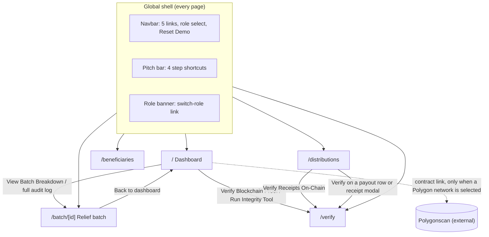

# Sitemap

Describes the frontend **as the code is today**, not as intended. Derived by reading `frontend/app/`, `frontend/components/` and `frontend/lib/`; the app was not run. Where the UI shows something the code does not back up, it is listed under [Gaps](#gaps).

## Routes

The app has five routes, all client-rendered (`"use client"`). There is no login page, no custom 404, no middleware and no Next.js API routes; every data call goes to the Python backend on port 8000.

| Route | File | Purpose | Reachable by |
|---|---|---|---|
| `/` | `app/page.tsx` | Dashboard: fund totals, pipeline summary, recent audit events, chain status card | Everyone |
| `/batch/[id]` | `app/batch/[id]/page.tsx` | One relief batch: totals, allocations per barangay, full audit timeline | Everyone |
| `/beneficiaries` | `app/beneficiaries/page.tsx` | Beneficiary list, duplicate review, register, bulk CSV analysis | Everyone; some actions role-gated |
| `/distributions` | `app/distributions/page.tsx` | Payout form and list of confirmed payouts | Everyone; submit is role-gated |
| `/verify` | `app/verify/page.tsx` | Check a payout receipt against the chain; fraud scenario buttons | Everyone |

`/verify` accepts an optional `?distribution_id=` query. Without it, it selects `DIST-0001`, or the first payout in the list if that ID is absent.

## Navigation map

`/beneficiaries` and `/verify` have no in-page links to other routes; users leave them through the shell.

## Global shell

Rendered by `app/layout.tsx` around every page.

| Element | File | Contents |
|---|---|---|
| Navbar | `components/Navbar.tsx` | Logo (to `/`), five links, role selector, Reset Demo button |
| Pitch bar | `components/DemoPitchBar.tsx` | Shortcuts: 1 Batch, 2 Beneficiaries, 3 Distributions, 4 Verify |
| Role banner | `components/RoleIndicatorBanner.tsx` | Explains the current role; one link cycles Citizen → Officer → Auditor → Citizen |
| Footer | `app/layout.tsx` | Static text, no links |

The Navbar's "Relief Batch" link and the pitch bar's step 1 both point at the fixed path `/batch/RELIEF-2026-001`.

## Page contents

### `/` Dashboard

- **Hero:** calamity name and batch ID from the API; links to the batch page and `/verify`.
- **Pipeline strip:** five step cards. Only the household count in step 4 is live data.
- **Metric cards:** released, allocated, distributed, beneficiaries and flagged counts from the API.
- **Audit timeline:** latest eight audit events.
- **Chain status card:** status label, network selector, contract address with copy and edit, explainer, link to `/verify`.
- **Refresh:** reloads every 10 seconds.

### `/batch/[id]`

- **Overview cards:** authorised amount, disbursed amount and count, source agency, recipient LGU.
- **Chain record card:** the batch's transaction hash.
- **Allocation table:** one row per barangay.
- **Audit timeline:** every audit event for the batch, oldest first.

### `/beneficiaries`

- **List:** table with search (name, ID, DAFAC ID, barangay) and a flagged-only filter.
- **Review modal:** opens from any row; shows record details, duplicate or anomaly callout, and role-dependent actions.
- **Register modal:** name and barangay; runs the duplicate check on submit.
- **CSV analyzer modal:** runs the bundled sample CSV or an uploaded `.csv` and lists suspected duplicate pairs.

### `/distributions`

- **Payout form:** beneficiary dropdown, amount, fixed sample receipt, submit button.
- **Scanner modal:** three hardcoded sample vouchers that fill the form.
- **Offline pill:** a toggle that changes its own label.
- **Payout list:** every confirmed payout with receipt hash, a receipt preview modal and a Verify link.

### `/verify`

- **Selector:** dropdown of all payouts; verification runs automatically on change.
- **Scenario buttons:** Pocketing Cash, Ghost Beneficiary, Restore Authentic Record.
- **Result card:** verdict, a "local record" box, a "blockchain seal" box, and a toggle for raw hashes.
- **Explainer cards:** three static benefit statements.

## Role gating

Roles are `Public Citizen` (default), `Barangay Officer` and `Auditor / COA`, held in `localStorage` under `ayudachain_role` by `lib/roleContext.tsx`. The backend does not know the role.

| Action | Citizen | Officer | Auditor |
|---|---|---|---|
| View every page and all data, including household names | Yes | Yes | Yes |
| Register a beneficiary | Yes | Yes | Yes |
| Run the CSV analyzer | Yes | Yes | Yes |
| Verify or reject a beneficiary | No | Yes | Yes |
| Delete a beneficiary | No | Yes | Yes |
| Confirm a payout | No | Yes | Yes |
| Run fraud scenarios on `/verify` | Yes | Yes | Yes |
| Reset demo data | Yes | Yes | Yes |

Officer and Auditor are identical in code: every check is `role !== "Public Citizen"`.

## Backend calls per page

All calls are defined in `frontend/lib/api.ts`.

| Page | Calls |
|---|---|
| `/` | `GET /api/dashboard` |
| `/batch/[id]` | `GET /api/batches/{id}` |
| `/beneficiaries` | `GET /api/beneficiaries`, `POST /api/beneficiaries`, `POST /api/beneficiaries/{id}/verify`, `DELETE /api/beneficiaries/{id}`, `POST /api/beneficiaries/upload-csv` |
| `/distributions` | `GET /api/distributions`, `GET /api/beneficiaries`, `POST /api/distributions/confirm` |
| `/verify` | `GET /api/distributions`, `GET /api/beneficiaries`, `POST /api/blockchain/verify` |
| Navbar | `POST /api/demo/reset` |

`fetchAuditTrail` is defined in `api.ts` and never called.

## Gaps

Places where the sitemap a user sees differs from what the code does.

- **Role selector is desktop-only.** The Navbar selector is hidden below the `lg` breakpoint. On smaller screens the role can only be changed through the banner link or the review modal's "Switch to Officer Mode" button.
- **Batch route is effectively single-batch.** Nothing lists batches, and the shell links to one fixed ID. Other IDs work only by typing the URL.
- **Dashboard pipeline strip is mostly hardcoded.** "₱10,000,000", "4 Barangays", "100% Allocated", "4 Flagged Records" and "Polygon Block #1" are literals in the page.
- **Network selector and contract address editor do nothing.** They change local page state only; no request is sent and the backend keeps its own configuration.
- **Receipt preview image likely fails to load.** The modal uses the stored path `/receipts/sample_relief_receipt.svg` relative to the frontend, but that file is served by the backend on port 8000 and `frontend/public/receipts/` does not exist. Not confirmed by running.
- **No route guards.** Role gating hides buttons inside pages; every route and every API endpoint is open.
- **Build checks are off.** `next.config.mjs` ignores TypeScript and ESLint errors during `next build`.
