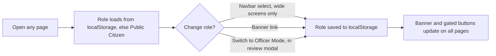
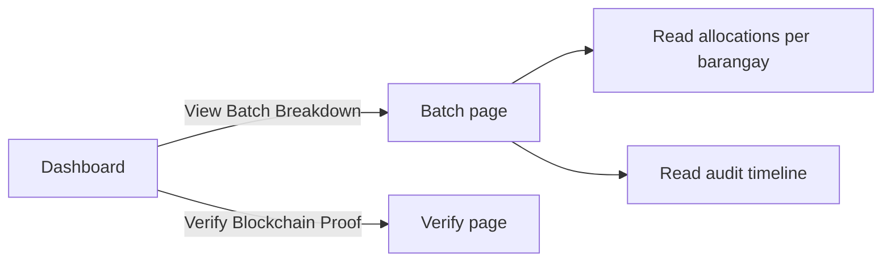
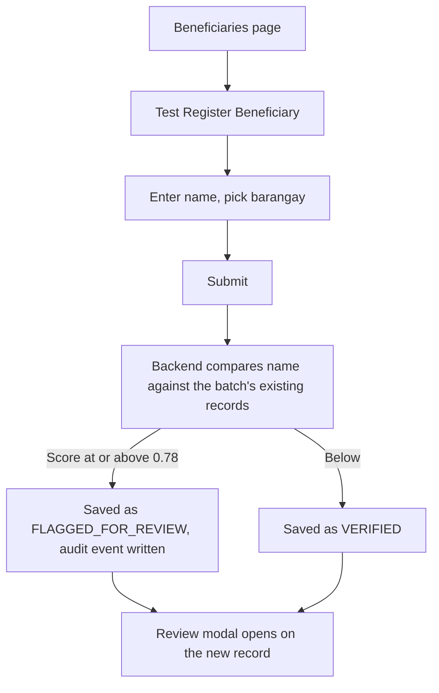
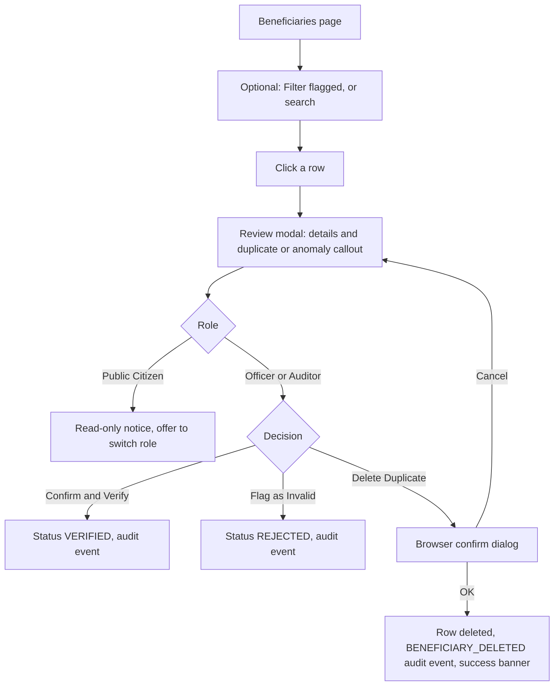
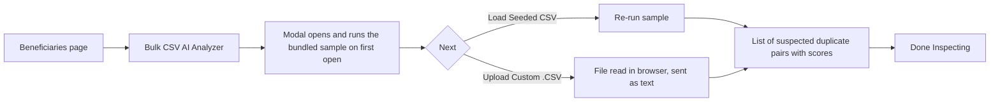
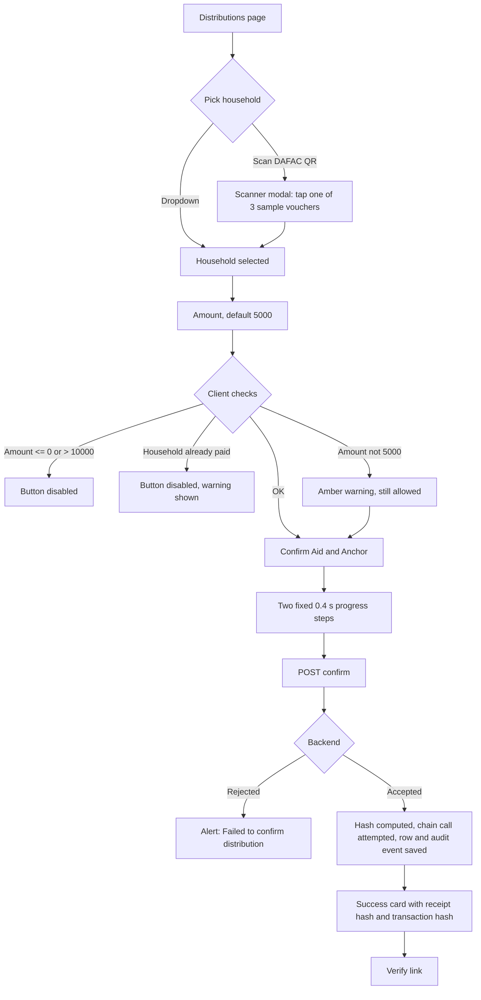
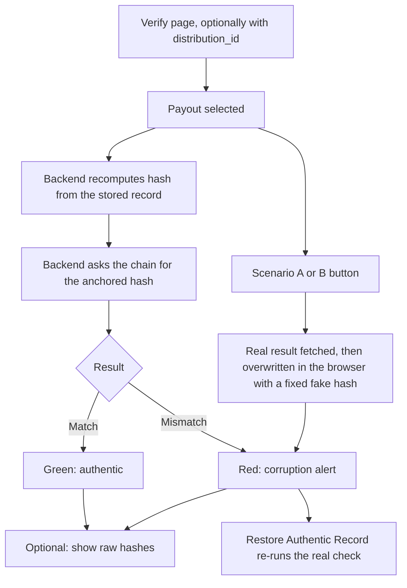

# User Flows

Describes what a user can do in the app **as the code is today**, not as intended. Derived by reading the frontend and `backend/server.py`; the app was not run, so behaviours marked "by reading" are unconfirmed at runtime. Routes and page contents are in [sitemap.md](sitemap.md).

Each flow lists the steps, then **Reality checks**: points where the screen tells the user something the code does not do.

## Roles

| Role | Stored value | What it unlocks |
|---|---|---|
| Public Citizen (default) | `Public Citizen` | Read everything, register a beneficiary, run the CSV analyzer, verify receipts |
| Barangay Officer | `Barangay Officer` | The above, plus review and delete beneficiaries and confirm payouts |
| COA Auditor | `Auditor / COA` | Identical to Barangay Officer |

There is no sign-in. A role is a browser setting any visitor can change.

## Flow 1: Choose a role

1. The user opens the app and is a Public Citizen.
2. They change role through the Navbar selector, the banner link (which steps Citizen → Officer → Auditor → Citizen), or the review modal's "Switch to Officer Mode" button.
3. The choice persists across reloads in that browser.

**Reality checks**

- No identity is checked. The backend never receives the role, so every gated action can also be done by calling the API directly.

## Flow 2: Follow the money (any role)

1. On the dashboard the user sees totals released, allocated and distributed, plus the latest eight audit events. The page refreshes every 10 seconds.
2. "View Batch Breakdown" opens the batch page with per-barangay allocations and the full audit timeline.
3. "Verify Blockchain Proof" opens the verify page (Flow 6).

**Reality checks**

- Four of the five pipeline cards on the dashboard show fixed text, not live figures.
- Every audit row with a transaction hash is shown with a lock icon. When the chain call failed, that hash was generated by the backend and is not a real transaction.
- If the dashboard request fails, a retry screen appears. The batch page instead shows "Relief batch not found" for any failure, including the backend being down.

## Flow 3: Register a beneficiary (any role)

1. The user opens the register modal, types a household head's name and picks one of four fixed barangays.
2. On submit the frontend creates the ID as `BEN-` plus the last four digits of the current timestamp.
3. The backend runs the duplicate check and saves the record as flagged or verified.
4. The list reloads and the review modal opens on the new record.

**Reality checks**

- Registration is not role-gated; a Public Citizen can add records.
- A non-duplicate is marked `VERIFIED` automatically with the note "Auto-verified", with no human or document check.
- The ID scheme can collide. A collision hits a unique constraint the backend does not handle, and the user sees a generic error alert (by reading).
- The modal's "Reasoning" list is fixed text and always says the barangay is identical, even for a cross-barangay match.

## Flow 4: Review a flagged beneficiary (Officer or Auditor)

1. The user filters to flagged records or searches, then opens a record.
2. The modal shows the match percentage and the ID of the suspected duplicate.
3. An Officer or Auditor verifies, rejects or deletes. Each writes an audit event.
4. Deletion can also be triggered from the trash icon on the table row.

**Reality checks**

- The modal shows only the ID of the matched record, not its details, so the reviewer cannot compare the two side by side without closing and finding the other row.
- A rejected record is displayed as "FLAGGED FOR REVIEW" in the table, because the table treats every non-verified status the same.
- The review note is always recorded as "Manual action by Auditor", whichever role acted.
- The audit event for a rejection reads "manually verified & approved".
- Any record can be deleted, not only flagged duplicates, and a deleted beneficiary who was already paid leaves an orphaned payout.
- The delete confirmation is in Filipino only.

## Flow 5: Analyse a masterlist CSV (any role)

1. The user opens the analyzer; the bundled sample is analysed immediately.
2. They may upload their own `.csv`. The backend compares every pair of rows on name, address and DAFAC ID.
3. Pairs scoring 80 or more are listed with an anomaly type and score breakdown.

**Reality checks**

- The analysis is display-only. Nothing is saved, no beneficiary is created or flagged, and no audit event is written.
- The expected columns (`first_name`, `last_name`, `address_street`, `barangay`, `city`, `dafac_id`, `beneficiary_id`) are not shown to the user, and a file with other headers silently yields poor results.
- Comparison is pairwise, so large files grow quadratically in time; there is no size limit.

## Flow 6: Confirm a payout (Officer or Auditor)

1. The form preselects the first verified beneficiary. The user keeps it, picks another from the dropdown, or uses the scanner.
2. The amount defaults to ₱5,000 and can be edited.
3. On submit the backend rejects a non-positive amount, an amount over ₱10,000, or a household that already has a payout. Any amount other than ₱5,000 sets an anomaly flag on the beneficiary and writes an extra audit event.
4. The backend computes the receipt hash, tries to anchor it on-chain, and saves the payout.
5. The user sees the hashes and can follow the link to verify.

**Reality checks**

- **The scanner does not scan.** No camera is opened; it offers three hardcoded households.
- **The amount is not locked.** The README says it auto-locks to ₱5,000; the field is freely editable up to ₱10,000.
- **Flagged or rejected households can be paid.** The dropdown lists every beneficiary and neither the frontend nor the backend checks verification status.
- **The offline toggle changes a label only.** Submitting while "offline" still calls the backend immediately. Nothing is queued or synced.
- **The receipt is always the same sample.** No file is uploaded and no OCR runs; the backend hashes a fixed demo text.
- **"Anchored" is shown regardless of outcome.** If the chain call fails, the backend stores a generated transaction hash, and the success card and the "Polygon Anchored" badge appear exactly as for a real anchor.
- **The first two progress steps are timers**, not real work; the off-chain save actually happens after the chain call.
- **The success card likely disappears almost immediately** (by reading): the handler resets the step to idle right after setting success, because it tests a stale value.
- **Backend rejection reasons are discarded.** The user sees a generic failure alert, not the ceiling or duplicate-claim message.
- **The payout ID can collide**, as in Flow 3.

## Flow 7: Verify a receipt (any role)

1. The user arrives directly or from a payout's Verify link, and may pick another payout from the dropdown.
2. Verification runs automatically on load and on every selection change; "Re-Check Authentic Record" runs it again.
3. The result card shows a verdict, a "local record" box and a "blockchain seal" box, with raw hashes behind a toggle.
4. The scenario buttons demonstrate a reduced amount or a swapped name.

**Reality checks**

- **Verification fails open.** If the chain is unreachable or has no record for the payout, the backend returns a match and echoes the local hash as the on-chain hash. The user sees a green "100% authentic" result for a record that was never anchored.
- **The fraud scenarios are staged in the browser.** No record is changed. The page replaces the real result with a fixed fake hash and a scripted message.
- **A name swap would not be detected for real.** The hashed payload contains the beneficiary ID, amount and receipt text, not the household name.
- **The "blockchain seal" box does not show chain data.** Its name comes from the current database record and its amount is the literal "₱5,000.00", even for a payout of a different amount.
- **The success wording assumes ₱5,000.** "The family received their exact ₱5,000" is shown for every verified payout.
- **Citizens can only pick from the full list of payouts.** There is no lookup by voucher or DAFAC ID, and every payout's beneficiary ID is visible to everyone.

## Flow 8: Reset demo data (any role)

1. The user clicks "Reset Demo" in the Navbar and accepts the browser confirm dialog.
2. The backend deletes every batch, allocation, beneficiary, payout and audit event, then reseeds the sample data.
3. A success strip shows and the page reloads after 1.2 seconds.

**Reality checks**

- Reset is available to every role and has no server-side protection.
- It erases the audit trail. On-chain records from before the reset remain, so reseeded IDs such as `DIST-0001` already exist on a long-running chain and their re-anchoring fails silently into the fallback path.

## Cross-cutting behaviour

- **Errors** surface as browser `alert()` dialogs with generic text; list-loading failures on the beneficiaries, distributions and verify pages are only logged to the console and leave an empty screen.
- **Language** is English with Filipino subtext, except a few Filipino-only strings (delete confirmation, delete success, role banners).
- **Fixed batch.** Registration and payouts always use batch `RELIEF-2026-001`; the frontend has no way to create a batch or an allocation even though the backend exposes both endpoints.
