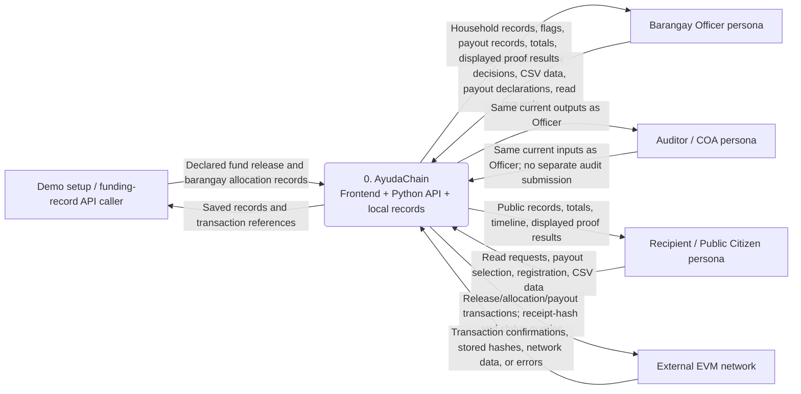
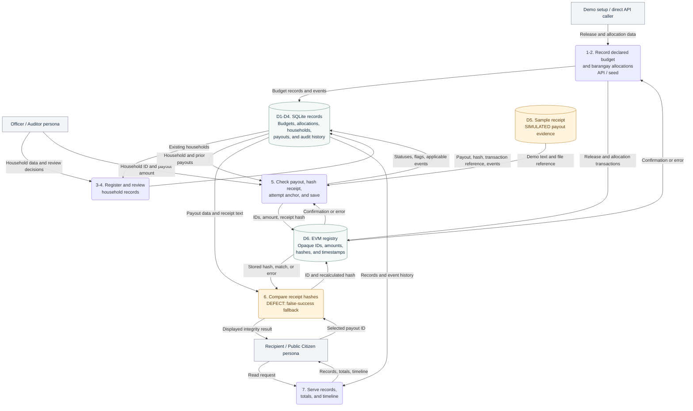
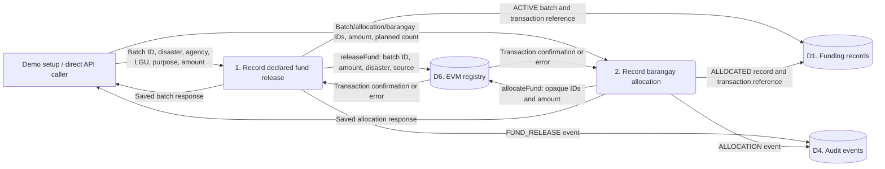
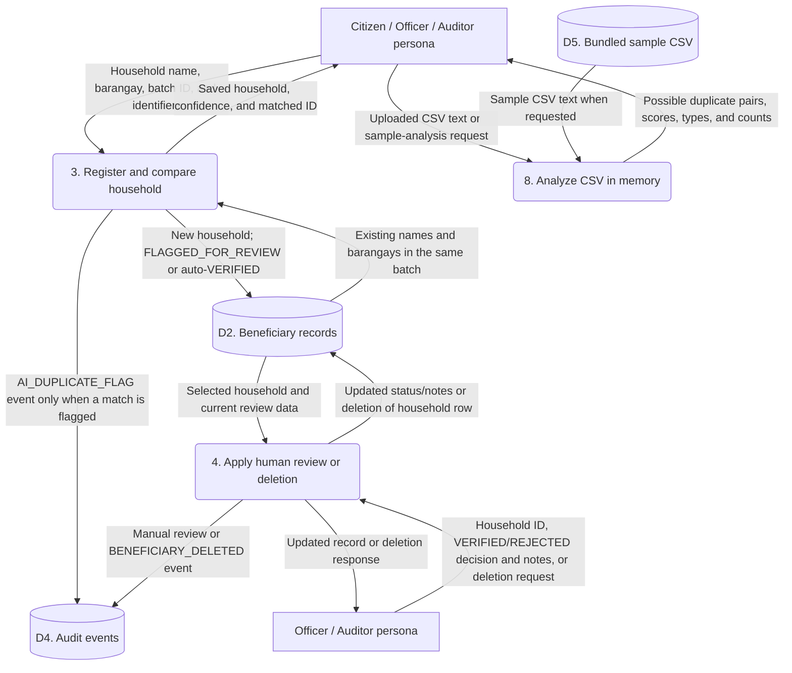
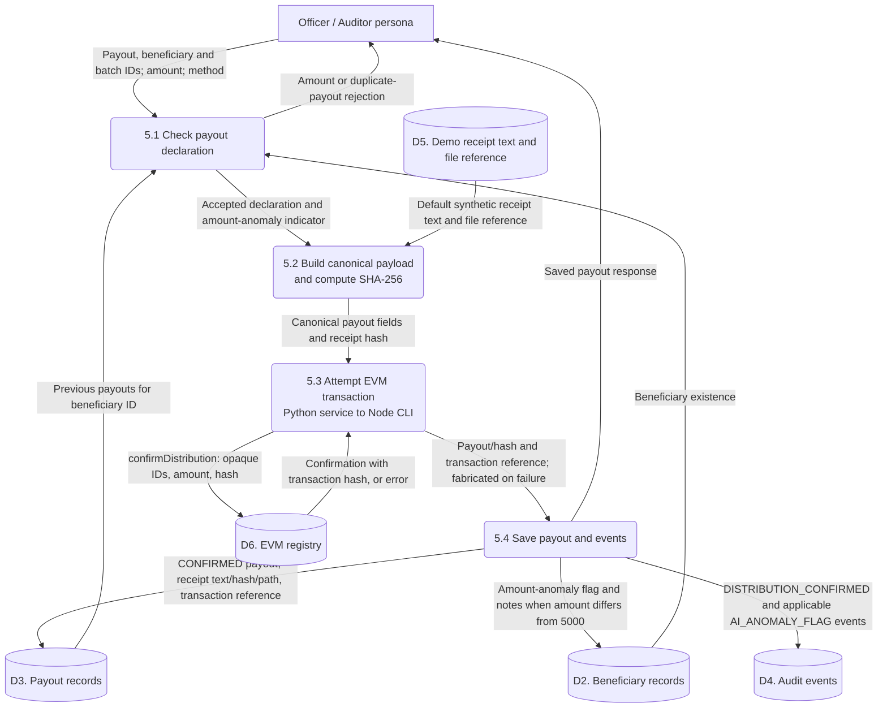
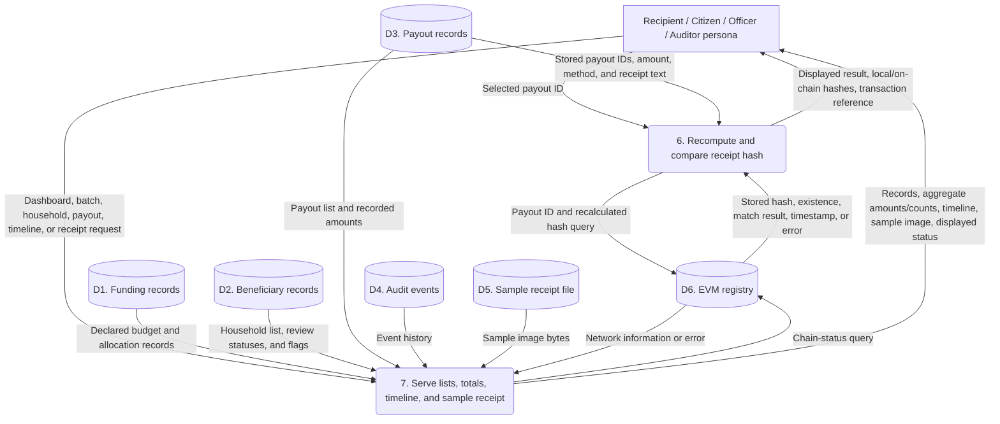
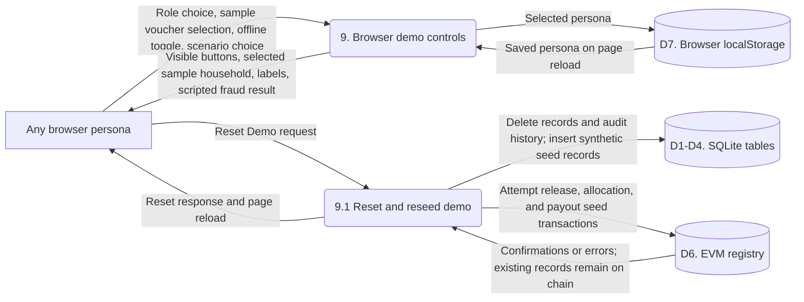
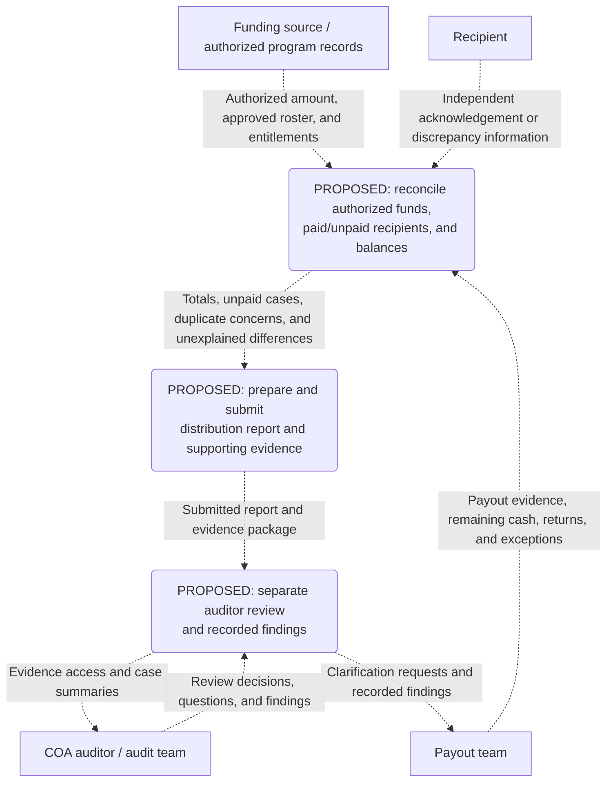

# AyudaChain data flow diagrams

Documented on 2026-10-08 from the current working tree. This describes the running backend, `backend/server.py`, its imported services, the frontend, and the Solidity registry. It does not describe the unused FastAPI backend as implemented behavior.

View or share the rendered overview as [SVG](diagrams/dfd-overview.svg) or [PNG](diagrams/dfd-overview.png). The editable Mermaid source and all process details are below.

The current system records declared relief funding and payouts. Actual government fund transfers and physical cash delivery take place outside AyudaChain. The normal demo starts with a synthetic fund batch, four barangay allocations, household records, and sample payouts already loaded. Funding and allocation creation also exist through direct API calls, but have no frontend forms.

The diagrams show **data moving between actors, processes, and stores**. An arrow labelled with an amount carries a record of that amount; it does not transfer money. Process numbers identify functions, not a mandatory sequence. Users can visit screens in any order, and beneficiary review does not currently gate payout recording.

## Reading the diagrams

| Symbol or label | Meaning |
|---|---|
| Rectangle | External actor or caller |
| Rounded box with a process number | A process inside AyudaChain |
| Cylinder with a store number | Stored data |
| Solid labelled arrow | A data path present in the current source |
| `API / seed` | Implemented endpoint or demo setup; no corresponding creation form |
| `SIMULATED` | Demo input or browser behavior that does not perform the operation its label suggests |
| `DEFECT` | Existing behavior that must not be treated as a reliable verification or security guarantee |
| Dashed arrows in the final diagram | Proposed extension from the discussed workflow; not implemented |

## Context: the system and its users

The funding-record caller represents synthetic demo setup or a caller supplying release/allocation metadata directly to the API. There is no live connection to DSWD, a treasury, or a bank. The Officer and Auditor labels are browser personas, not authenticated identities. A relief recipient can use the public screens, but there is no personal account or recipient-specific lookup.

All browser personas can also request a demo reset. Browser roles hide some buttons, but the API accepts requests without authenticating the caller or enforcing those roles. There is no actual recipient acknowledgement or cash-receipt confirmation input today.

## Overview: funding records to the recipient's view

This overview groups the existing off-chain tables into one store for readability. The detailed diagrams below separate the records and cover the CSV and demo-control paths.

**The recipient's current interaction is reading public records and choosing a payout to check.** The app does not deliver money, obtain a recipient's signature, or establish that the recipient received the declared amount. Household names and other records are exposed through the current public views/API; off-chain storage does not imply private access.

## Stored data

| Store | Actual location | Contents and limitations |
|---|---|---|
| D1. Funding records | `backend/ayudachain.db`: `relief_batches`, `allocations` | Declared released amount, agency/disaster metadata, barangay amounts, planned beneficiary counts, statuses, and transaction references. No government release-document or bank-statement integration. |
| D2. Beneficiary records | Same SQLite database: `beneficiaries` | Opaque ID, synthetic `DFC-2026-XXXX` identifier, household name, barangay, contact, similarity flags, review status, and notes. No complete approved-entitlement or identity-document workflow. |
| D3. Payout records | Same SQLite database: `distributions` | Payout/beneficiary/batch IDs, amount, method, normalized receipt text, receipt hash, sample file path, status, transaction reference, and time. `CONFIRMED` is saved even when anchoring fails. |
| D4. Audit events | Same SQLite database: `audit_events` | Descriptions of releases, allocations, duplicate flags, manual reviews, deletions, and payouts. Some state changes have no event; see defects below. Demo reset deletes this history. |
| D5. Demo files | `backend/app/data/receipts/sample_relief_receipt.svg`; `backend/app/data/seed_beneficiaries.csv`; receipt text in `receipt_generator.py` | Generated synthetic receipt and sample masterlist. No per-payout upload, camera capture, or OCR pipeline. |
| D6. EVM registry | `AyudaChainRegistry.sol`: `batches`, `allocations`, `distributions` | Declared amounts, opaque IDs, disaster/source metadata, receipt hashes, timestamps, and events. The contract records assertions and does not transfer relief money. |
| D7. Browser role setting | Browser `localStorage`: `ayudachain_role` | Selected Citizen, Officer, or Auditor persona. Never sent to the API as an authenticated role. |

The contract also exposes `anchoredRecords` and `anchorRecord`, but the running API and CLI do not connect them to a report-submission workflow.

## Detail A: funding and barangay allocation records

- API paths: `POST /api/funds/releases` and `POST /api/allocations`. `seed_default_data()` also calls the same blockchain service directly while loading demo data.
- Chain calls happen before the corresponding database insert. The application saves records even when the chain call fails; the service fabricates a transaction reference on failure.
- The contract checks authorized wallet access and record existence/uniqueness. It does not enforce that allocations sum to the released budget or that payouts remain within a barangay allocation.
- The frontend normally uses the fixed batch `RELIEF-2026-001`. There is no budget-release or allocation-entry screen.

## Detail B: beneficiary registration, human review, and CSV analysis

Registration compares normalized names, with a same-barangay confidence boost, against stored records in the requested batch. At a score of at least `0.78`, the new record is flagged; otherwise it is automatically marked `VERIFIED`. This status does not establish identity or eligibility. Human review stores a decision and notes but does not capture independent identity evidence.

CSV analysis is a separate process: it compares pairs within the submitted file using names, address fields, and DAFAC identifiers, and returns pairs scoring at least `80`. **There is intentionally no arrow from CSV analysis to the database:** results are displayed only, with no import, saved flags, or audit event.

Deletion removes the beneficiary row and writes an event. It does not delete or repair that beneficiary's existing payout records. The API has no role enforcement, so the reviewer persona labels do not provide an authorization boundary.

## Detail C: payout validation, hashing, and anchoring

The API accepts `POST /api/distributions/confirm` and its `/api/distributions` alias. It checks that the beneficiary exists, that `0 < amount <= 10000`, and that the beneficiary ID has no earlier payout. The payout duplicate check is not limited to the current batch. Amounts other than `5000` are flagged rather than rejected. These numbers are hardcoded demo rules, not a statement of actual program entitlements or statutory limits.

The process does not check an approved entitlement, beneficiary approval status, allocation balance, or physical receipt of assistance. A flagged or rejected household can therefore still receive a recorded payout. No bank or payment-provider API is called.

The canonical hash payload contains `distribution_id`, `beneficiary_id`, `batch_id`, amount formatted to two decimal places, normalized `ocr_content`, and `verification_method`. It excludes the household name, contact number, receipt image bytes, and receipt filename. Changing those excluded fields alone will not change the receipt hash.

The UI supplies a sample receipt filename and the API defaults to demo receipt text. A direct caller can supply receipt text/method, but there is no OCR or per-payout file-upload process. The two initial UI progress steps are timers; the actual chain attempt precedes the payout insert. A failed chain attempt still leads to a `CONFIRMED` database row and a fabricated transaction reference.

## Detail D: receipt verification and public summaries

Verification reads the payout, recalculates its covered hash, and queries `verifyReceipt` plus the stored distribution in the contract. A real match establishes consistency with the committed fields. It does not establish original truth, claimant eligibility, or cash delivery.

**DEFECT:** if the chain call fails or the chain record is absent, `blockchain.py` currently substitutes the local hash as the on-chain hash and returns a successful match. Thus the diagram's displayed result is not necessarily a real chain-backed result. Network-status failures are also presented as success/standby metadata, which the dashboard can label connected.

Summary totals are calculated from SQLite records. `unallocated_funds` is the non-negative difference between declared release and allocations; it is not remaining cash or proof of reconciliation. The batch page sums recorded payouts. Neither process accounts for actual cash remaining, returned funds, or every approved but unpaid household. Several dashboard pipeline labels are hardcoded.

The sample image is served by the backend's `/receipts/` route. The frontend preview uses a relative path, so the existence of this backend file path does not ensure that the preview loads correctly in the frontend.

## Detail E: browser simulations and demo reset

- **SIMULATED QR scan:** selecting one of three sample vouchers fills a household and amount. No camera or QR decoder runs.
- **SIMULATED offline mode:** the toggle changes text. Payout submission still calls the API immediately; there is no persistent offline queue or synchronization process.
- **SIMULATED fraud scenarios:** the verification screen fetches a result, then overrides displayed values with fixed hashes and messages. It does not change a database record or chain record. Restore re-runs the verification request.
- **Network/address controls:** local page state changes do not update the backend's chain configuration.
- **Reset:** `POST /api/demo/reset` deletes all operational rows and audit events, then reseeds. It does not clear the chain; attempting to reuse seeded IDs on the same deployment can fail.

## Unimplemented reporting and COA review extension

This separate diagram represents the reporting portion discussed with the maintainer. It is **conceptual and not implemented**, and is not an adopted PRD or a claim about an official government procedure. The existing app does not have these inputs, report stores, submissions, or auditor outcomes.

An approved roster and independent payout evidence are needed to assess whether every intended recipient received assistance. A receipt hash alone cannot supply those facts. For a payout-only scenario, a reconciliation could compare funds made available with documented payouts, cash remaining, and cash returned; the actual reporting rules and accountable roles remain undecided. `docs/product/prd.md` is absent, and finance-officer drafts are an alternative under consideration rather than implemented scope.

## Current integrity gaps shown by these data paths

1. Chain failure or an absent anchor can be displayed as a successful verification. Failed writes can be represented by fabricated transaction references.
2. The browser persona is not authenticated or enforced by the API. Officer and Auditor actions are identical.
3. A similarity check can auto-label a household `VERIFIED`; review status does not gate payouts.
4. Only flagged registrations write an audit event; a normal registration has no creation event. Manual rejection uses the same `BENEFICIARY_VERIFIED` event text as approval. There is no authenticated actor recorded for those decisions.
5. Deletion can leave a payout without its beneficiary record. Demo reset deletes event history and leaves chain history intact.
6. Payout checks do not enforce allocation balances, approved entitlements, or complete budget reconciliation. The contract has no cash-transfer operation.
7. The hash covers specific payout fields, not names or actual receipt image bytes. A name change alone is outside the current hash coverage.
8. No report submission, independent recipient confirmation, complete paid/unpaid reconciliation, or separate auditor sign-off process is connected to the current system.

## Source map and documentation conflicts

| Diagram processes | Current implementation |
|---|---|
| 1-2 and demo seeding | `backend/server.py`: `seed_default_data()`, `/api/funds/releases`, `/api/allocations` |
| 3-4 and 8 | `backend/server.py`: beneficiary registration/review/deletion and CSV endpoints; `backend/app/ai/entity_resolution.py`; `frontend/app/beneficiaries/page.tsx` |
| 5 | `backend/server.py`: payout endpoints; `backend/app/services/hasher.py`; `backend/app/services/receipt_generator.py`; `frontend/app/distributions/page.tsx` |
| 6-7 | `backend/server.py`: read, verification, and receipt endpoints; dashboard/batch/verify frontend pages |
| Chain transport and failure behavior | `backend/app/services/blockchain.py` → `contracts/scripts/blockchain_client.js` → `contracts/contracts/AyudaChainRegistry.sol` |
| 9 | `frontend/lib/roleContext.tsx`; `frontend/components/Navbar.tsx`; distributions/verify demo controls; `backend/server.py`: `/api/demo/reset` |

[Current user flows](../product/user-flow.md) and [sitemap](../product/sitemap.md) describe the screen-level behavior. The [product investigation](../reviews/2026-10-08-product-investigation/product-review.md) records earlier runtime evidence and its limitations.

The older [architecture](architecture.md) describes FastAPI and broader receipt/OCR capabilities than the running code provides. The [API contract](api-contract.md) describes successful anchoring without its current failure behavior. This DFD follows the actual running implementation and labels those differences; creating it does not fix the underlying behavior or certify the older documents' claims.
